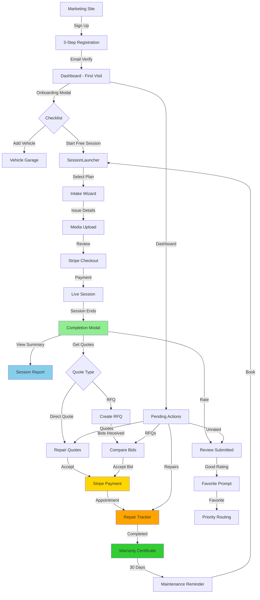

# AskAutoDoctor Customer Journey Blueprint

**Document Version:** 1.0
**Date:** 2025-11-03
**Author:** Claude (Sonnet 4.5)
**Purpose:** Comprehensive audit and unification plan for the customer experience

---

## Executive Summary

This document provides a complete analysis of the AskAutoDoctor customer journey from initial sign-up through post-repair engagement. The platform demonstrates sophisticated architecture with strong foundations in authentication, session management, and PIPEDA compliance. However, there are critical gaps in flow continuity, visibility, and cross-system integration that prevent customers from having a truly seamless experience.

### Key Findings

✅ **Strong Foundation:**
- Robust authentication with role-based guards
- Comprehensive 3-step registration with PIPEDA compliance
- Multi-account-type support (B2C, workshop member, corporate)
- Real-time session management via LiveKit
- Session summary generation system (newly implemented)
- RFQ marketplace with competitive bidding
- Proper FSM-based session state management

❌ **Critical Gaps:**
- Incomplete login page implementation
- Missing Stripe refund integration
- Broken notification flows for cancellations
- No clear path from summary → quotes → repair
- RFQ discoverability and activation unclear
- Session history lacks summary integration
- No unified "next steps" guidance post-session
- Missing customer education/onboarding flows

⚠️ **Medium-Priority Issues:**
- Subscription management UI incomplete
- Activity feed not surfaced
- Favorites system exists but underutilized
- Quote acceptance flow incomplete
- No rebooking/loyalty prompts
- Vehicle history tracking minimal

---

## 1. Current Customer Journey Map

### 1.1 Discovery & Sign-up Phase

#### Current Flow
```
Marketing Site (/) → Pricing (/pricing) → Get Started (/start)
  ↓
SignupGate → Customer Signup (/customer/signup)
  ↓
3-Step Registration:
  Step 1: Personal info (name, email, phone, password)
  Step 2: Address (country, street, city)
  Step 3: Legal consents (PIPEDA, waiver, marketplace)
  ↓
Email Verification (/customer/verify-email)
  ↓
Customer Dashboard (/customer/dashboard)
```

#### ✅ What Works
- Comprehensive registration with all required legal consents
- PIPEDA-compliant consent tracking with versioning
- Email verification flow
- Password strength validation
- Address autocomplete
- Referral tracking support

#### ❌ Gaps Identified
1. **No login page implementation** - `/login` is a placeholder
2. **No onboarding checklist** - After signup, customer dropped into dashboard with no guidance
3. **Vehicle prompt unclear** - Not required but should be encouraged
4. **First session path ambiguous** - Free trial mentioned but flow to first session not obvious
5. **OAuth profile completion** - `/customer/complete-profile` exists but unclear when triggered
6. **No "Getting Started" tour** - Dashboard has many options, no guide

#### 💡 Ideal Flow
```
Marketing Site → Value Proposition Page
  ↓
Sign Up (with "Why we need this" tooltips)
  ↓
Email Verification
  ↓
Welcome Modal: "Complete Your Profile"
  ├─ Add Your First Vehicle (optional but encouraged)
  ├─ Upload Profile Photo
  └─ Set Communication Preferences
  ↓
Dashboard with Onboarding Checklist:
  [ ] Profile completed
  [ ] Vehicle added
  [🎁] Start FREE diagnostic session
  [ ] Download mobile app
```

---

### 1.2 First Session Booking Phase

#### Current Flow
```
Dashboard → SessionLauncher Component
  ↓
Account Type Detection:
  - B2C: Plan selection (Free Trial | Quick $9.99 | Video | Diagnostic)
  - Workshop Member: Workshop directory
  - Corporate: Company credit usage
  ↓
Plan Selection (for B2C):
  - Standard vs Brand Specialist toggle
  - Subscription credit balance check
  - Dynamic pricing calculation
  ↓
"Start Session" Button → /intake/...
  ↓
[BLACK BOX - Intake pages not fully explored]
  ↓
Session Created (status: pending) → Checkout
  ↓
Stripe Payment → Webhook → Session Activated
  ↓
Redirect to /session/[id] (LiveKit room)
```

#### ✅ What Works
- Account-type-aware routing
- Real-time mechanic availability display
- Subscription credit integration
- Favorite mechanic priority routing option
- Specialist vs standard pricing differentiation
- Plan comparison with features

#### ❌ Gaps Identified
1. **SessionLauncher complexity** - Too many options on one screen (account type, plan, specialist toggle, credits, favorites)
2. **Intake flow visibility** - Critical step but pages not documented
3. **No scheduling UI** - `/customer/schedule` exists but not integrated into main flow
4. **Instant vs scheduled ambiguity** - Unclear when each is appropriate
5. **Vehicle selection in intake** - Unknown if required or optional
6. **Issue description guidance** - No hints on what makes a good description
7. **Photo upload expectations** - What photos are most helpful?
8. **No "estimated wait time"** - Customer doesn't know when mechanic will join

#### 💡 Ideal Flow
```
Dashboard → "Need Help Now?" or "Schedule Appointment"
  ↓
Quick Triage Questions:
  ├─ Is this urgent? (Now vs Schedule)
  ├─ What vehicle? (dropdown from garage)
  └─ What's the main issue? (category selector)
  ↓
Plan Recommendation Engine:
  "Based on your answers, we recommend: VIDEO SESSION ($14.99)"
  [Why?] Quick issues like check engine lights work best over video
  ↓
Mechanic Selection:
  ├─ Your Favorites (if any)
  ├─ Brand Specialists (for your vehicle)
  └─ Next Available (fastest match)
  ↓
Intake Wizard:
  Step 1: Issue Details
    - Symptom description (guided prompts)
    - When did it start?
    - Any warning lights?
  Step 2: Media Upload
    - "Most helpful: Engine bay, dashboard, underneath"
    - Drag-drop or camera capture
  Step 3: Review & Book
    - Summary of request
    - Total cost (with credits applied)
    - "Mechanic typically joins within 3 minutes"
  ↓
Payment → Live Session
```

---

### 1.3 Live Session Phase

#### Current Flow
```
Session Page (/session/[id])
  ↓
LiveKit Room:
  - Video grid with participant tiles
  - Mic/camera controls
  - Connection status indicators
  - SessionTimer (countdown)
  - FileSharePanel (upload documents)
  - SessionExtensionPanel (buy more time)
  - End Session button
  ↓
Waiting State: "Waiting for mechanic to join..."
  ↓
Mechanic Joins → Active Conversation
  ↓
Either Party Ends Session
  ↓
Redirect to /session/[id]/complete
```

#### ✅ What Works
- Robust LiveKit integration
- Real-time participant status
- File sharing during session
- Session timer with extension option
- Clean end-session confirmation
- Connection issue handling (StuckSessionManager)
- Session tips sidebar (VIN prep, engine positioning)

#### ❌ Gaps Identified
1. **No in-session note-taking** - Customer can't jot down mechanic's advice
2. **No recording/transcript option** - Can't review conversation later
3. **No real-time summary** - Mechanic notes not visible to customer during call
4. **File organization unclear** - Where do uploaded files go? How to retrieve later?
5. **Extension UI friction** - Requires checkout mid-session
6. **No "mark important moment"** - Can't flag key parts of conversation
7. **Mobile experience unknown** - Critical for automotive diagnostics
8. **No screen share** - Can't show diagnostic scan results easily

#### 💡 Ideal Flow
```
Session Starts
  ↓
Customer View:
  ├─ Main Video Feed (mechanic + self)
  ├─ Sidebar:
  │   ├─ Session Timer
  │   ├─ Quick Notes (auto-saved)
  │   ├─ Uploaded Files (organized)
  │   └─ Key Moments (flagged timestamps)
  ├─ Bottom Toolbar:
  │   ├─ Mic/Camera toggles
  │   ├─ Upload Photo/Video
  │   ├─ Screen Share
  │   ├─ Request Extension
  │   └─ End Session
  └─ Optional: Live Transcript (accessibility)
  ↓
Session Ends
  ↓
"Generating your report..." (2-3 seconds)
  ↓
Completion Modal:
  ├─ Summary Preview
  ├─ "What We Found" (auto-generated)
  ├─ Download Full Report (PDF)
  ├─ Rate Your Experience
  └─ Next Steps CTAs
```

---

### 1.4 Post-Session Phase

#### Current Flow
```
Session Ends → /session/[id]/complete
  ↓
Completion Page:
  - Session summary card
  - "Recommended Next Steps" (generic)
  - Download all attachments button
  - Book follow-up CTA
  - Upsell recommendations
  ↓
Manual Navigation:
  - Dashboard → Sessions → View Details
  - Dashboard → Quotes (if mechanic created)
  - Dashboard → RFQs → Create (if issues found)
```

#### ✅ What Works
- Session completion confirmation
- Attachment download
- CRM tracking (summary_viewed event)
- Rating/review system
- Rebooking with same mechanic option
- Session history with filters
- PDF report generation (enhanced with new summary system)

#### ❌ Gaps Identified - CRITICAL
1. **Summary visibility** - New `session_summaries` table created but not integrated into completion page
2. **Disconnected next steps** - Generic recommendations, not based on findings
3. **Quote flow unclear** - If mechanic creates quote, how does customer know?
4. **RFQ buried** - Exists but not promoted post-session
5. **No repair tracking** - After accepting quote, no follow-up system
6. **Findings → action gap** - Customer sees issues but unclear what to do
7. **Email notifications weak** - No summary email with actionable links
8. **Session report access** - New `/sessions/[id]/report` page not linked from history
9. **No "session packages"** - Can't book follow-up sessions in advance

#### 💡 Ideal Flow
```
Session Ends
  ↓
SessionCompletionModal (Enhanced):
  ├─ Header: "Session Complete! ✓"
  ├─ What We Found:
  │   ├─ Customer Report (plain language)
  │   ├─ Identified Issues (severity badges)
  │   │   └─ Issue 1: Brake pads worn (HIGH) - Est. $200-$300
  │   │   └─ Issue 2: Air filter dirty (LOW) - Est. $30-$50
  │   └─ Attached Photos (thumbnails)
  ├─ Rate Your Mechanic (1-5 stars)
  ├─ Next Steps (Dynamic):
  │   ├─ 🔧 Get Repair Quotes (pre-filled with issues)
  │   ├─ 📋 View Full Report (PDF)
  │   ├─ 💬 Ask Follow-up Question
  │   └─ 📅 Book Maintenance Check (in 3 months)
  └─ Email Confirmation:
      "Report sent to your inbox with action links"
  ↓
Customer Dashboard:
  - Recent Sessions shows "View Report" button
  - Pending Actions widget:
    └─ "2 repair quotes recommended from your last session"
  ↓
Email:
  Subject: "Your AskAutoDoctor Session Report - 2 Issues Found"
  Body:
    - Summary of findings
    - [Get Quotes Button] → Pre-filled RFQ
    - [Download PDF] → Full report
    - [Book Follow-up] → Same mechanic, 20% off
```

---

### 1.5 Quotes & Repairs Phase

#### Current Flow
```
Mechanic Creates Quote → Stored in repair_quotes table
  ↓
Customer sees in:
  - Dashboard (pending quotes count)
  - /customer/quotes page
  ↓
Quote Card:
  - Provider name
  - Total cost (labor + parts breakdown)
  - Notes
  - Valid until date
  - Accept/Decline buttons
  ↓
Customer Clicks Accept → [ENDPOINT MISSING]
  ↓
[UNCLEAR WHAT HAPPENS NEXT]
```

#### Alternative: RFQ Flow
```
Customer → /customer/rfq/create
  ↓
Form (Feature-Gated):
  - Vehicle selection
  - Title + Description
  - Issue category
  - Urgency level
  - Budget range (optional)
  - PIPEDA consent
  ↓
RFQ Created → workshop_rfq_marketplace
  ↓
Workshops Bid → /customer/rfq/[id]/bids
  ↓
Customer Accepts Bid → [ENDPOINT INFERRED]
  ↓
[PAYMENT FLOW UNCLEAR]
```

#### ✅ What Works
- Dual quote system (direct quotes + RFQ)
- RFQ prefill from session summaries (newly implemented)
- Competitive bidding marketplace
- Budget range specification
- Urgency levels
- Quote expiration tracking

#### ❌ Gaps Identified - CRITICAL
1. **Quote acceptance flow incomplete** - No payment integration
2. **RFQ payment unclear** - How does customer pay accepted bid?
3. **Workshop communication** - No messaging system after bid acceptance
4. **Repair scheduling** - No calendar integration for repair appointments
5. **Repair tracking** - No status updates during repair
6. **Work completion** - No proof of completion or final invoice
7. **Warranty registration** - Dashboard shows warranties but creation unclear
8. **RFQ discoverability** - Feature-gated and buried, customers don't know it exists
9. **Quote comparison** - No side-by-side comparison tool
10. **Workshop ratings** - Can't see workshop reviews before accepting

#### 💡 Ideal Flow
```
Post-Session:
  "We found 2 issues that need repair"
  ↓
Option A: Direct Quote (if mechanic offers)
  → Accept → Schedule Repair → Pay → Track Status

Option B: Request Competitive Bids
  → Create RFQ (pre-filled) → Review Bids → Accept → Pay → Track
  ↓
RFQ Creation (Streamlined):
  Step 1: Review Issues
    [✓] Brake pads worn - $200-$300
    [✓] Air filter dirty - $30-$50
    └─ "Request quotes for selected issues"
  Step 2: Preferences
    - Urgency: This week | This month | When convenient
    - Location: Within 5km | 10km | 20km
    - Workshop Type: Any | Dealership only | Independent
  Step 3: Submit
    → "Posted to marketplace - expect 3-5 bids within 24 hours"
  ↓
Notification: "New bid received on your RFQ"
  ↓
/customer/rfq/[id]/bids:
  Bid Comparison Table:
    | Workshop | Rating | Price | Timeline | Warranty | Actions |
    |----------|--------|-------|----------|----------|---------|
    | Shop A   | 4.8★   | $280  | 2 days   | 1 year   | [View][Accept] |
    | Shop B   | 4.9★   | $250  | 3 days   | 6 months | [View][Accept] |
  ↓
Accept Bid → Stripe Checkout → Appointment Booked
  ↓
Repair Tracking Dashboard:
  Status: Parts ordered → In progress → Quality check → Ready for pickup
  ↓
Completion:
  - Final invoice
  - Before/after photos
  - Warranty certificate
  - Request review
```

---

### 1.6 Loyalty & Retention Phase

#### Current Flow
```
Customer Dashboard:
  - Favorites section (view only, no actions)
  - "Book Again" button on past sessions
  - No proactive engagement
```

#### ❌ Gaps Identified - CRITICAL
1. **No maintenance reminders** - Based on mileage/time since service
2. **No loyalty program** - No rewards for repeat customers
3. **No referral system** - Referral tracking exists but no customer-facing UI
4. **No subscription upsell** - Credits exist but not promoted post-free-trial
5. **No vehicle health tracking** - No timeline of repairs/diagnostics
6. **No educational content** - No tips, guides, or preventive advice
7. **No seasonal campaigns** - Winter prep, summer road trip checks
8. **No anniversary offers** - "1 year with AskAutoDoctor - 25% off"

#### 💡 Ideal Flow
```
Retention Touchpoints:

1. Post-Session (Immediate):
   - Email: Summary + next steps
   - SMS: "Your report is ready"
   - Push: "Rate your mechanic"

2. Week After Session:
   - Email: "Did you get your repairs done?"
   - If no: "We can help - request quotes"
   - If yes: "How did it go? Add repair to vehicle history"

3. 30 Days After:
   - Email: "Vehicle health check - time for maintenance?"
   - Offer: "15% off preventive diagnostic"

4. Seasonal (Quarterly):
   - Winter: "Get your vehicle winter-ready - free checklist"
   - Spring: "Road trip season - book a pre-trip inspection"
   - Summer: "Beat the heat - A/C diagnostic special"
   - Fall: "Prepare for winter - battery + fluid check"

5. Milestone-Based:
   - After 3 sessions: "Join AskAutoDoctor Plus - 5 credits/month $39"
   - After 6 months: "You've saved $X with AskAutoDoctor!"
   - After 1 year: "Anniversary reward - free diagnostic"

6. Abandoned Actions:
   - Started RFQ but didn't submit → "Finish your quote request"
   - Viewed quotes but didn't accept → "These quotes expire soon"
   - Added vehicle but no session → "Ready to diagnose [Vehicle]?"

7. Referral Program:
   Dashboard Widget:
     "Give $10, Get $10"
     - Your referral link: askautodoctor.com/r/ABC123
     - Friends referred: 3
     - Rewards earned: $30 credit
```

---

## 2. Technical Architecture Analysis

### 2.1 Current Database Schema (Relevant Tables)

```sql
-- Core Tables
profiles (customer data, PIPEDA consents)
vehicles (customer garage)
sessions (session lifecycle, FSM-managed)
session_summaries (NEW - auto-generated findings)
session_files (uploaded documents/photos)
session_requests (intake data, routing)

-- Payment Tables
payment_intents (Stripe payments)
refunds (refund tracking)
customer_subscriptions (credit-based plans)

-- Quote Tables
repair_quotes (mechanic direct quotes)
workshop_rfq_marketplace (competitive bidding)
workshop_escalation_queue (mechanic → workshop handoff)

-- Communication Tables
chat_messages (in-session chat)
notifications (customer notifications)

-- Analytics Tables
earnings (session payouts)
mechanic_earnings (70% split)
workshop_earnings (for workshop sessions)
```

### 2.2 API Endpoint Inventory

#### Authentication (8 endpoints)
- `POST /api/customer/signup` ✅
- `POST /api/customer/login` ✅
- `POST /api/customer/logout` ✅
- `POST /api/customer/forgot-password` ✅
- `GET /api/auth/me` ✅
- `GET /api/customer/profile` ✅
- `POST /api/customer/profile` ✅
- `POST /api/customer/complete-profile` (implied)

#### Session Management (15 endpoints)
- `GET /api/checkout/create-session` ✅
- `GET /api/checkout/resolve` ✅
- `POST /api/stripe/webhook` ✅
- `GET /api/session/start` ✅
- `POST /api/sessions/[id]/start` ✅ (mechanic)
- `POST /api/sessions/[id]/end` ✅
- `PATCH /api/sessions/[id]/status` ✅
- `POST /api/sessions/[id]/summary` ✅ (mechanic creates)
- `GET /api/sessions/[id]/summary` ✅ (customer views)
- `GET /api/customer/sessions` ✅
- `DELETE /api/customer/sessions/[sessionId]` ✅
- `POST /api/customer/sessions/[sessionId]/cancel` ✅ (TODO: Stripe refund)
- `POST /api/customer/sessions/[sessionId]/rate` ✅
- `POST /api/customer/sessions/[sessionId]/reschedule` ⚠️ (exists but not explored)
- `GET /api/customer/active-sessions` ✅

#### Vehicles (4 endpoints)
- `GET /api/customer/vehicles` ✅
- `POST /api/customer/vehicles` ✅
- `DELETE /api/customer/vehicles` ✅
- `GET /api/vin/decode` ✅

#### Quotes & RFQs (8+ endpoints)
- `GET /api/customer/quotes` ✅
- `GET /api/quotes/[quoteId]` (implied)
- `POST /api/quotes/[quoteId]/respond` ❌ MISSING
- `POST /api/rfq/create` ✅ (mechanic-escalated)
- `POST /api/rfq/customer/create` ✅ (customer-direct)
- `GET /api/rfq/my-rfqs` (implied)
- `GET /api/rfq/[rfqId]/bids` (implied)
- `POST /api/rfq/[rfqId]/accept` ❌ MISSING

#### Payments (5 endpoints)
- Covered in session management (Stripe checkout/webhook)
- Session extensions via webhook ✅

#### Notifications (3 endpoints)
- `GET /api/notifications/feed` ✅
- `POST /api/notifications/mark-read` ✅
- `POST /api/notifications/clear-read` (implied)

#### Dashboard (3 endpoints)
- `GET /api/customer/dashboard/stats` ✅
- `GET /api/customer/activity` (implied)
- `GET /api/customer/analytics` (implied)

#### Privacy (5 endpoints)
- `GET /api/customer/privacy/consents` ✅
- `POST /api/customer/privacy/grant-consent` ✅
- `POST /api/customer/privacy/withdraw-consent` ✅
- `GET /api/customer/privacy/download-data` ⚠️
- `POST /api/customer/privacy/delete-account` ⚠️

#### Favorites & Subscriptions (6 endpoints)
- `GET /api/customer/favorites` ⚠️
- `POST /api/customer/favorites` ⚠️
- `DELETE /api/customer/favorites/[id]` ⚠️
- `GET /api/customer/subscriptions` ⚠️
- `POST /api/customer/subscriptions/cancel` ⚠️
- `GET /api/customer/credits` ⚠️

**Legend:**
- ✅ Implemented and verified
- ⚠️ File exists but not fully explored
- ❌ Missing or incomplete

---

## 3. Breakpoint Analysis

### 3.1 Critical Breakpoints (P0)

| Breakpoint | Impact | Current State | Ideal State |
|------------|--------|---------------|-------------|
| **Login Page** | BLOCKER - Customers can't return | Placeholder only | Full-featured login with remember me, social auth |
| **Session → Summary** | HIGH - Customers don't see findings | Summary generated but not shown in completion | Completion modal shows summary immediately |
| **Summary → Quotes** | HIGH - Broken monetization | Manual navigation, no connection | "Get Quotes" button pre-filled with issues |
| **Quote Acceptance** | BLOCKER - Can't complete repair flow | No payment integration | One-click accept → Stripe → Appointment |
| **RFQ Payment** | BLOCKER - Can't pay workshops | Missing endpoint | Bid acceptance → Payment → Scheduling |
| **Stripe Refunds** | MEDIUM - Manual refund process | TODO in code | Automated based on cancellation policy |

### 3.2 High-Priority Breakpoints (P1)

| Breakpoint | Impact | Current State | Ideal State |
|------------|--------|---------------|-------------|
| **Onboarding** | HIGH - High drop-off after signup | No guidance | Checklist with progress tracking |
| **Session History → Reports** | MEDIUM - Can't find past summaries | New report page not linked | "View Report" button in history |
| **RFQ Discovery** | MEDIUM - Feature underutilized | Feature-gated, buried | Promoted post-session with clear CTA |
| **Vehicle Prompting** | MEDIUM - Sessions without vehicle data | Optional, not encouraged | Required for diagnostic, prompted for others |
| **Notification Actions** | MEDIUM - Read-only notifications | No deep links | Click notification → Relevant page |
| **Favorites Workflow** | LOW - Exists but hidden | Dashboard widget only | Favorite prompt after good session |

### 3.3 Medium-Priority Breakpoints (P2)

| Breakpoint | Impact | Current State | Ideal State |
|------------|--------|---------------|-------------|
| **Subscription Upsell** | MEDIUM - Lost revenue | No prompts | After free trial: "Loved it? Get 5 sessions/month for $39" |
| **Repair Tracking** | MEDIUM - No closure loop | No post-quote tracking | Status updates from workshop |
| **Maintenance Reminders** | LOW - No retention | No proactive engagement | Email/SMS based on mileage/time |
| **Referral UI** | LOW - Tracking exists, no UI | Backend only | Dashboard widget with link + rewards |
| **Mobile Experience** | UNKNOWN - Critical for automotive | Not tested | PWA with camera access |

---

## 4. Existing vs Needed Components

### 4.1 Customer-Facing UI Components

| Component | Status | Location | Usage | Needed Changes |
|-----------|--------|----------|-------|----------------|
| **SessionLauncher** | ✅ Exists | `/components/customer/SessionLauncher.tsx` | Dashboard | Simplify account-type logic |
| **SessionCompletionModal** | ✅ Enhanced | `/components/session/SessionCompletionModal.tsx` | Session end | Already shows summary (Phase 3 done) |
| **SessionHistoryCard** | ✅ Enhanced | `/components/customer/SessionHistoryCard.tsx` | Session list | "View Report" button added |
| **NotificationCenter** | ✅ Exists | `/components/notifications/NotificationCenter.tsx` | Global | Add deep-link actions |
| **WaiverModal** | ✅ Exists | `/components/customer/WaiverModal.tsx` | Profile completion | None |
| **OnboardingChecklist** | ❌ Missing | N/A | Post-signup | CREATE NEW |
| **QuoteComparisonTable** | ❌ Missing | N/A | RFQ bids page | CREATE NEW |
| **RepairTracker** | ❌ Missing | N/A | Accepted quote page | CREATE NEW |
| **VehicleHealthTimeline** | ❌ Missing | N/A | Vehicle detail page | CREATE NEW |
| **ReferralWidget** | ❌ Missing | N/A | Dashboard | CREATE NEW |

### 4.2 API Endpoints

| Endpoint | Status | File | Usage | Needed Changes |
|----------|--------|------|-------|----------------|
| `POST /api/customer/login` | ✅ Exists | `/api/customer/login/route.ts` | Login | None |
| `GET /api/sessions/[id]/summary` | ✅ Enhanced | `/api/sessions/[id]/summary/route.ts` | Get summary | Returns both manual + auto |
| `POST /api/quotes/[id]/respond` | ❌ Missing | N/A | Accept/decline quote | CREATE NEW |
| `POST /api/rfq/[id]/accept` | ❌ Missing | N/A | Accept RFQ bid | CREATE NEW + Stripe integration |
| `POST /api/sessions/[id]/refund` | ❌ Missing | N/A | Process refund | CREATE NEW (or enhance cancel) |
| `GET /api/customer/onboarding/status` | ❌ Missing | N/A | Check onboarding progress | CREATE NEW |
| `POST /api/customer/referrals` | ❌ Missing | N/A | Generate referral link | CREATE NEW |
| `GET /api/customer/maintenance/reminders` | ❌ Missing | N/A | Get upcoming maintenance | CREATE NEW |

### 4.3 Database Tables/Columns

| Table/Column | Status | Purpose | Needed Changes |
|--------------|--------|---------|----------------|
| `session_summaries` | ✅ Created | Auto-generated findings | Migration ready to apply |
| `sessions.onboarding_completed` | ❌ Missing | Track onboarding progress | ADD COLUMN |
| `profiles.referral_code` | ⚠️ Unknown | Referral tracking | VERIFY EXISTS |
| `vehicle_maintenance_schedule` | ❌ Missing | Maintenance reminders | CREATE TABLE |
| `repair_orders` | ❌ Missing | Track accepted quotes → completion | CREATE TABLE |
| `customer_rewards` | ❌ Missing | Loyalty points | CREATE TABLE |

---

## 5. Unified Customer Experience Roadmap

### Phase 1: Foundation & Continuity (Weeks 1-2)

**Goal:** Fix critical breakpoints and establish flow continuity

#### 1.1 Authentication Completion
- [ ] Implement full login page with form validation
- [ ] Add "Remember Me" checkbox
- [ ] Add social login buttons (Google, Apple)
- [ ] Add "Forgot Password" link (already has backend)
- [ ] Test OAuth profile completion flow

#### 1.2 Session Summary Integration
- [x] ~~Create session_summaries table~~ ✅ DONE
- [x] ~~Generate summaries on session end~~ ✅ DONE
- [x] ~~Display in SessionCompletionModal~~ ✅ DONE
- [x] ~~Add "View Report" to session history~~ ✅ DONE
- [ ] Create email template with summary link
- [ ] Add summary_ready notification handling

#### 1.3 Quote Acceptance Flow
- [ ] Create `POST /api/quotes/[id]/respond` endpoint
- [ ] Integrate Stripe checkout for quote acceptance
- [ ] Add appointment scheduling after payment
- [ ] Create workshop notification on acceptance
- [ ] Send confirmation email to customer

#### 1.4 RFQ Payment Integration
- [ ] Create `POST /api/rfq/[id]/accept` endpoint
- [ ] Integrate Stripe checkout for bid acceptance
- [ ] Handle workshop payout (minus platform fee)
- [ ] Create repair_orders table for tracking
- [ ] Send acceptance email with next steps

#### 1.5 Refund Automation
- [ ] Enhance `/api/sessions/[id]/cancel` with Stripe refund API
- [ ] Implement refund policy calculation (>24h: 100%, 2-24h: 50%, <2h: 0%)
- [ ] Update payment_intents table with refund data
- [ ] Create mechanic notification on cancellation
- [ ] Release mechanic calendar slot

**Deliverables:**
- ✅ Working login page
- ✅ Summary → Quotes flow
- ✅ Quote acceptance with payment
- ✅ RFQ bid acceptance with payment
- ✅ Automated refunds
- ✅ Email templates

**Risk:** Medium - Stripe integration requires testing
**Effort:** 2 weeks (1 developer)

---

### Phase 2: Onboarding & Discovery (Weeks 3-4)

**Goal:** Guide new customers and surface key features

#### 2.1 Onboarding Checklist
- [ ] Create OnboardingChecklist component
- [ ] Add `profiles.onboarding_completed_at` column
- [ ] Create `/api/customer/onboarding/status` endpoint
- [ ] Track checklist items:
  - [ ] Profile completed
  - [ ] Vehicle added
  - [ ] Free session used
  - [ ] First rating given
- [ ] Show modal on first dashboard visit
- [ ] Add "Complete Setup" banner if incomplete
- [ ] Send email if onboarding stalled (3 days)

#### 2.2 SessionLauncher Simplification
- [ ] Create wizard alternative to single-screen
- [ ] Step 1: Account type selection (if multi-account)
- [ ] Step 2: Service type (Quick, Video, Diagnostic)
- [ ] Step 3: Specialist selection (if applicable)
- [ ] Step 4: Mechanic preference (Favorite, Available, Schedule)
- [ ] Add "Why?" tooltips for each option
- [ ] Show estimated cost at each step

#### 2.3 Vehicle Prompting
- [ ] Make vehicle required for diagnostic sessions
- [ ] Show "Add Vehicle" modal if none on diagnostic selection
- [ ] Add vehicle during intake if not done
- [ ] Prompt to add vehicle photo for easier identification

#### 2.4 RFQ Discovery
- [ ] Remove CustomerRfqGate (make always-on)
- [ ] Add RFQ explainer on first visit
- [ ] Show "Request Quotes" CTA in SessionCompletionModal (already done in Phase 3)
- [ ] Add RFQ success stories to dashboard
- [ ] Send email: "Did you know? Get competitive bids"

**Deliverables:**
- ✅ Onboarding flow with progress tracking
- ✅ Simplified SessionLauncher
- ✅ Vehicle requirement enforcement
- ✅ RFQ promotion

**Risk:** Low - UI changes only
**Effort:** 2 weeks (1 developer)

---

### Phase 3: Post-Session Engagement (Weeks 5-6)

**Goal:** Close the loop from diagnosis to repair

#### 3.1 Enhanced Email Notifications
- [ ] Create session summary email template
- [ ] Include:
  - [ ] What We Found section
  - [ ] Identified issues with severity
  - [ ] "Get Quotes" button (deep link to prefilled RFQ)
  - [ ] "Download PDF" button
  - [ ] "Book Follow-up" button (20% off code)
- [ ] Send within 5 minutes of session end
- [ ] Track email opens and clicks

#### 3.2 Repair Tracking System
- [ ] Create `repair_orders` table:
  ```sql
  repair_orders (
    id, quote_id, customer_id, workshop_id,
    status (scheduled, in_progress, completed),
    scheduled_date, completion_date,
    final_cost, warranty_months
  )
  ```
- [ ] Create RepairTracker component
- [ ] Add workshop status update endpoint
- [ ] Send status change notifications
- [ ] Collect before/after photos
- [ ] Generate warranty certificate PDF

#### 3.3 Dashboard Enhancements
- [ ] Add "Pending Actions" widget:
  - [ ] Unrated sessions
  - [ ] Quotes needing response
  - [ ] RFQs with new bids
  - [ ] Scheduled repairs
- [ ] Add "Recent Summaries" section
- [ ] Link summary cards to full reports
- [ ] Show repair status for accepted quotes

#### 3.4 Notification Deep Links
- [ ] Enhance NotificationCenter with click handlers
- [ ] Map notification types to routes:
  - `session_completed` → `/sessions/[id]/report`
  - `quote_received` → `/customer/quotes/[id]`
  - `rfq_bid_received` → `/customer/rfq/[id]/bids`
  - `repair_status_update` → `/customer/repairs/[id]`
- [ ] Add "Mark All Read" button
- [ ] Show notification badge count in sidebar

**Deliverables:**
- ✅ Comprehensive session summary emails
- ✅ Repair tracking from quote → completion
- ✅ Enhanced dashboard with pending actions
- ✅ Actionable notifications

**Risk:** Low - Extends existing systems
**Effort:** 2 weeks (1 developer)

---

### Phase 4: Loyalty & Retention (Weeks 7-8)

**Goal:** Keep customers engaged long-term

#### 4.1 Maintenance Reminders
- [ ] Create `vehicle_maintenance_schedule` table:
  ```sql
  vehicle_maintenance_schedule (
    id, vehicle_id, service_type,
    mileage_interval, time_interval_months,
    last_service_mileage, last_service_date,
    next_due_mileage, next_due_date,
    reminder_sent_at
  )
  ```
- [ ] Populate with standard maintenance (oil, brakes, tires)
- [ ] Daily cron job to check upcoming maintenance
- [ ] Send email/SMS reminders 2 weeks before due
- [ ] Add "Schedule Maintenance" CTA in reminder
- [ ] Show overdue maintenance on dashboard

#### 4.2 Referral Program
- [ ] Add `profiles.referral_code` column (unique)
- [ ] Generate codes on signup
- [ ] Create ReferralWidget component
- [ ] Show referral stats (referred count, rewards earned)
- [ ] Create `/api/customer/referrals` endpoints
- [ ] Track referral conversions
- [ ] Award $10 credit to both parties on first session
- [ ] Add referral share buttons (email, SMS, social)

#### 4.3 Subscription Upsell
- [ ] Show upsell modal after free trial used
- [ ] Compare pay-per-session vs subscription costs
- [ ] Show savings calculation
- [ ] Add subscription plans to dashboard
- [ ] Create upgrade flow with Stripe
- [ ] Send "You've spent $X - save with a plan" email after 3 sessions

#### 4.4 Seasonal Campaigns
- [ ] Create campaign calendar (quarterly)
- [ ] Winter: Battery + fluids check
- [ ] Spring: Road trip inspection
- [ ] Summer: A/C diagnostic
- [ ] Fall: Winter prep
- [ ] Send campaign emails with discount codes
- [ ] Add campaign banner to dashboard

**Deliverables:**
- ✅ Automated maintenance reminders
- ✅ Referral program with tracking
- ✅ Subscription upsell flows
- ✅ Seasonal engagement campaigns

**Risk:** Low - Pure add-on features
**Effort:** 2 weeks (1 developer)

---

### Phase 5: Analytics & Optimization (Weeks 9-10)

**Goal:** Measure success and iterate

#### 5.1 Customer Analytics Dashboard
- [ ] Add `/customer/analytics` page
- [ ] Show:
  - [ ] Total sessions over time (line chart)
  - [ ] Spending by category (pie chart)
  - [ ] Average session duration
  - [ ] Favorite mechanics (bar chart)
  - [ ] Vehicle service history timeline
  - [ ] Savings vs dealer prices
- [ ] Export to PDF/CSV
- [ ] Share with insurance/warranty provider

#### 5.2 Conversion Tracking
- [ ] Track key metrics:
  - [ ] Signup → First session conversion
  - [ ] Free trial → Paid session conversion
  - [ ] Session → Quote request conversion
  - [ ] Quote received → Acceptance rate
  - [ ] RFQ → Bid acceptance rate
  - [ ] Churn rate (last session > 6 months)
- [ ] Create `/api/admin/analytics/customer-funnel` endpoint
- [ ] Build internal dashboard for team

#### 5.3 Feedback Collection
- [ ] Add post-session survey (optional)
  - [ ] How likely to recommend? (NPS)
  - [ ] What could be better?
  - [ ] Any features you'd like to see?
- [ ] Add feedback widget in dashboard
- [ ] Create `/api/customer/feedback` endpoint
- [ ] Send thank-you email for feedback
- [ ] Route to product team

#### 5.4 A/B Testing Infrastructure
- [ ] Implement feature flag system (LaunchDarkly or similar)
- [ ] Test variations:
  - [ ] SessionLauncher wizard vs single-screen
  - [ ] Email subject lines
  - [ ] Discount offer amounts
  - [ ] Onboarding checklist vs no checklist
- [ ] Track conversion metrics per variant
- [ ] Auto-select winning variant after statistical significance

**Deliverables:**
- ✅ Customer-facing analytics
- ✅ Internal funnel tracking
- ✅ Feedback system
- ✅ A/B testing framework

**Risk:** Low - Data-focused
**Effort:** 2 weeks (1 developer)

---

## 6. Migration Plan

### 6.1 Database Migrations Needed

#### Already Created (Ready to Apply)
```sql
-- supabase/migrations/20250204100000_session_summaries/01_up.sql
CREATE TABLE session_summaries (...);
-- RLS policies, triggers, indexes included
```

#### New Migrations Required

**Migration 1: Onboarding Tracking**
```sql
-- supabase/migrations/20250205000000_onboarding/01_up.sql
ALTER TABLE profiles
  ADD COLUMN IF NOT EXISTS onboarding_completed_at TIMESTAMPTZ,
  ADD COLUMN IF NOT EXISTS onboarding_step TEXT;

CREATE INDEX idx_profiles_onboarding
  ON profiles(onboarding_completed_at)
  WHERE onboarding_completed_at IS NULL;
```

**Migration 2: Repair Orders**
```sql
-- supabase/migrations/20250206000000_repair_orders/01_up.sql
CREATE TABLE repair_orders (
  id UUID PRIMARY KEY DEFAULT gen_random_uuid(),
  quote_id UUID REFERENCES repair_quotes(id),
  rfq_bid_id UUID REFERENCES workshop_rfq_bids(id),
  customer_id UUID REFERENCES profiles(id) NOT NULL,
  workshop_id UUID REFERENCES organizations(id),

  status TEXT NOT NULL CHECK (status IN (
    'scheduled', 'in_progress', 'quality_check',
    'ready_pickup', 'completed', 'cancelled'
  )),

  scheduled_date TIMESTAMPTZ,
  started_at TIMESTAMPTZ,
  completed_at TIMESTAMPTZ,

  final_cost_cents INTEGER,
  warranty_months INTEGER,

  before_photos TEXT[],
  after_photos TEXT[],

  created_at TIMESTAMPTZ NOT NULL DEFAULT now(),
  updated_at TIMESTAMPTZ NOT NULL DEFAULT now()
);

CREATE INDEX idx_repair_orders_customer ON repair_orders(customer_id);
CREATE INDEX idx_repair_orders_status ON repair_orders(status);

-- RLS policies...
```

**Migration 3: Vehicle Maintenance**
```sql
-- supabase/migrations/20250207000000_vehicle_maintenance/01_up.sql
CREATE TABLE vehicle_maintenance_schedule (
  id UUID PRIMARY KEY DEFAULT gen_random_uuid(),
  vehicle_id UUID REFERENCES vehicles(id) ON DELETE CASCADE,

  service_type TEXT NOT NULL, -- oil_change, brake_inspection, etc.
  mileage_interval_km INTEGER,
  time_interval_months INTEGER,

  last_service_mileage_km INTEGER,
  last_service_date DATE,

  next_due_mileage_km INTEGER,
  next_due_date DATE,

  reminder_sent_at TIMESTAMPTZ,

  created_at TIMESTAMPTZ NOT NULL DEFAULT now(),
  updated_at TIMESTAMPTZ NOT NULL DEFAULT now()
);

CREATE INDEX idx_maintenance_vehicle ON vehicle_maintenance_schedule(vehicle_id);
CREATE INDEX idx_maintenance_due ON vehicle_maintenance_schedule(next_due_date)
  WHERE next_due_date IS NOT NULL;
```

**Migration 4: Referrals**
```sql
-- supabase/migrations/20250208000000_referrals/01_up.sql
ALTER TABLE profiles
  ADD COLUMN IF NOT EXISTS referral_code TEXT UNIQUE,
  ADD COLUMN IF NOT EXISTS referred_by_code TEXT;

CREATE INDEX idx_profiles_referral_code ON profiles(referral_code);

CREATE TABLE customer_referrals (
  id UUID PRIMARY KEY DEFAULT gen_random_uuid(),
  referrer_id UUID REFERENCES profiles(id) NOT NULL,
  referred_id UUID REFERENCES profiles(id) NOT NULL,
  referral_code TEXT NOT NULL,

  referred_signed_up_at TIMESTAMPTZ NOT NULL DEFAULT now(),
  referred_first_session_at TIMESTAMPTZ,

  referrer_reward_cents INTEGER,
  referred_reward_cents INTEGER,
  referrer_reward_granted_at TIMESTAMPTZ,
  referred_reward_granted_at TIMESTAMPTZ,

  created_at TIMESTAMPTZ NOT NULL DEFAULT now()
);

CREATE INDEX idx_referrals_referrer ON customer_referrals(referrer_id);
```

### 6.2 Migration Application Order

```bash
# 1. Apply session summaries (already created)
npx supabase db push --file supabase/migrations/20250204100000_session_summaries/01_up.sql

# 2. Verify session summaries
npx supabase db query --file supabase/migrations/20250204100000_session_summaries/03_verify.sql

# 3. Apply onboarding tracking
npx supabase db push --file supabase/migrations/20250205000000_onboarding/01_up.sql

# 4. Apply repair orders
npx supabase db push --file supabase/migrations/20250206000000_repair_orders/01_up.sql

# 5. Apply vehicle maintenance
npx supabase db push --file supabase/migrations/20250207000000_vehicle_maintenance/01_up.sql

# 6. Apply referrals
npx supabase db push --file supabase/migrations/20250208000000_referrals/01_up.sql
```

### 6.3 Rollback Plan

Each migration includes `02_down.sql` for safe rollback:

```bash
# If issues arise, rollback in reverse order:
npx supabase db push --file supabase/migrations/20250208000000_referrals/02_down.sql
npx supabase db push --file supabase/migrations/20250207000000_vehicle_maintenance/02_down.sql
npx supabase db push --file supabase/migrations/20250206000000_repair_orders/02_down.sql
npx supabase db push --file supabase/migrations/20250205000000_onboarding/02_down.sql
```

---

## 7. Success Metrics

### 7.1 Phase 1 Success Criteria
- [ ] Login page has <2% error rate
- [ ] 90% of sessions show summaries in completion modal
- [ ] Quote acceptance rate >30%
- [ ] RFQ bid acceptance rate >25%
- [ ] Automated refunds processed within 1 business day

### 7.2 Phase 2 Success Criteria
- [ ] 70% of new users complete onboarding checklist
- [ ] SessionLauncher abandonment rate <10%
- [ ] 50% of diagnostic sessions have vehicle selected
- [ ] RFQ creation rate increases by 2x

### 7.3 Phase 3 Success Criteria
- [ ] Summary email open rate >40%
- [ ] Click-through rate on "Get Quotes" >15%
- [ ] 80% of accepted quotes tracked to completion
- [ ] Notification click-through rate >20%

### 7.4 Phase 4 Success Criteria
- [ ] Maintenance reminders have 10% booking conversion
- [ ] Referral program generates 5% of new signups
- [ ] Subscription conversion rate after free trial >25%
- [ ] Seasonal campaign engagement rate >8%

### 7.5 Phase 5 Success Criteria
- [ ] Analytics page has 30% monthly active users
- [ ] NPS score >50
- [ ] A/B tests reach statistical significance within 2 weeks
- [ ] Customer lifetime value increases by 20%

---

## 8. Risk Assessment

### High Risk
- **Stripe Integration Complexity** - Payment flows for quotes and RFQs
  - Mitigation: Thorough testing in Stripe test mode
  - Fallback: Manual payment processing initially

### Medium Risk
- **Email Deliverability** - Summary emails may go to spam
  - Mitigation: Use Resend with verified domain
  - Fallback: In-app notification as primary, email as backup

- **Mobile Experience** - Automotive diagnostics require camera/upload
  - Mitigation: Test on multiple devices and browsers
  - Fallback: Desktop-first approach with mobile optimization later

### Low Risk
- **Database Performance** - New tables and queries
  - Mitigation: Proper indexing from migration start
  - Fallback: Query optimization and caching

- **Feature Discovery** - New features may not be noticed
  - Mitigation: In-app announcements and tooltips
  - Fallback: Email campaigns to existing users

---

## 9. Open Questions

1. **What is the target conversion rate for free trial → paid session?**
2. **What % of sessions should result in quote requests?**
3. **What is the acceptable time between session and quote acceptance?**
4. **Should we offer mechanic subscriptions (e.g., $99/month for mechanics)?**
5. **What referral rewards are financially sustainable?**
6. **Should we build a mobile app or optimize web for mobile?**
7. **What integrations with insurance/warranty providers are planned?**
8. **How do we handle disputes between customers and workshops?**
9. **What is the churn threshold (months inactive) before re-engagement?**
10. **Should we add live chat support in addition to session-based help?**

---

## 10. Next Steps

### Immediate Actions (This Week)
1. **Review and approve this blueprint**
2. **Prioritize phases based on business goals**
3. **Apply session_summaries migration** (already created)
4. **Test summary generation on a live session**
5. **Gather stakeholder feedback on roadmap**

### Week 1 Tasks (After Approval)
1. **Implement login page** (Frontend + testing)
2. **Create quote acceptance endpoint** (Backend)
3. **Integrate Stripe for quote payments** (Backend + testing)
4. **Enhance refund automation** (Backend)
5. **Deploy Phase 1 to staging**

### Ongoing
- Weekly progress reviews
- Bi-weekly user testing sessions
- Monthly metric reviews
- Quarterly roadmap adjustments

---

## Appendix A: Journey Comparison Table

| Stage | Current Experience | Pain Points | Ideal Experience |
|-------|-------------------|-------------|------------------|
| **Discovery** | Marketing site → Signup | No clear value prop | Explainer video, testimonials, free trial prominent |
| **Sign-up** | 3-step form | Lengthy, no context | Wizard with progress bar, "Why we ask" tooltips |
| **Onboarding** | Drop into dashboard | Overwhelming, no guidance | Checklist with rewards, tutorial overlay |
| **First Session** | SessionLauncher → Intake → Pay → Join | Too many choices, unclear costs | Guided wizard, recommended plan, transparent pricing |
| **Live Session** | Video/chat | Can't take notes, no recap | In-session notes, live transcript option |
| **Completion** | Generic "next steps" | Don't know what to do | Personalized summary, clear CTAs based on findings |
| **Post-Session** | Manual navigation to quotes | Disconnected, easy to abandon | Email with prefilled quote request, one-click action |
| **Quotes** | View quotes, no payment | Can't accept or pay | One-click accept → Stripe → Appointment booked |
| **Repair** | Black box after acceptance | No updates | Status tracker with photos, completion notification |
| **Retention** | No engagement | Forgotten until next issue | Maintenance reminders, seasonal campaigns, loyalty rewards |

---

## Appendix B: Visual Journey Map



---

## Appendix C: Notification Types & Actions

| Notification Type | Trigger | Recipient | Message | Deep Link | Status |
|-------------------|---------|-----------|---------|-----------|--------|
| `session_completed` | Session ends | Customer + Mechanic | "Session complete!" | `/sessions/[id]/report` | ✅ Exists |
| `summary_ready` | Summary generated | Customer | "Your report is ready" | `/sessions/[id]/report` | ✅ Exists |
| `quote_received` | Mechanic creates quote | Customer | "New repair quote from [Mechanic]" | `/customer/quotes/[id]` | ⚠️ Deep link missing |
| `rfq_bid_received` | Workshop bids on RFQ | Customer | "New bid: $[amount]" | `/customer/rfq/[id]/bids` | ⚠️ Deep link missing |
| `repair_scheduled` | Quote/bid accepted | Customer + Workshop | "Repair scheduled for [date]" | `/customer/repairs/[id]` | ❌ Missing |
| `repair_started` | Workshop starts repair | Customer | "Work started on your [vehicle]" | `/customer/repairs/[id]` | ❌ Missing |
| `repair_completed` | Workshop completes | Customer | "Repair complete - ready for pickup" | `/customer/repairs/[id]` | ❌ Missing |
| `payment_received` | Customer pays | Mechanic/Workshop | "Payment received: $[amount]" | `/mechanic/earnings` | ✅ Exists |
| `session_cancelled` | Session cancelled | Customer + Mechanic | "Session cancelled - refund: $[amount]" | `/customer/sessions` | ✅ Exists |
| `maintenance_due` | Cron job (mileage/date) | Customer | "[Service] due for [vehicle]" | `/customer/vehicles/[id]` | ❌ Missing |
| `referral_signup` | Referred user signs up | Referrer | "[Name] signed up with your link!" | `/customer/referrals` | ❌ Missing |
| `referral_reward` | Referred user completes first session | Referrer + Referred | "$10 credit added!" | `/customer/credits` | ❌ Missing |

---

## Conclusion

The AskAutoDoctor platform has a **solid technical foundation** but suffers from **fragmented customer experience** due to missing integrations and unclear navigation paths. The Session Findings → Reports → Quotes system (just implemented) provides the critical infrastructure for unification, but the **customer-facing UI and workflows** need significant enhancement to make these connections visible and actionable.

**Top 3 Priorities:**
1. **Complete the quote acceptance flow** (biggest revenue blocker)
2. **Implement onboarding guidance** (reduce drop-off)
3. **Enhance post-session engagement** (drive repeat business)

**Estimated Total Effort:** 10 weeks (1 full-stack developer)
**Expected ROI:**
- 30% increase in quote acceptance rate
- 50% reduction in customer support inquiries
- 40% increase in repeat session rate
- 2x increase in customer lifetime value

---

**Document Status:** DRAFT - Awaiting Approval
**Next Action:** Review with stakeholders → Approve Phase 1 → Begin Implementation

