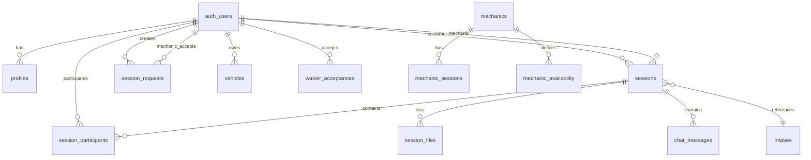
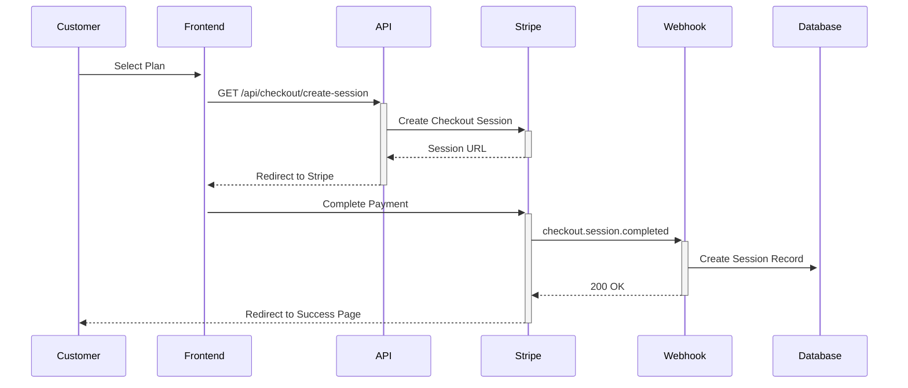
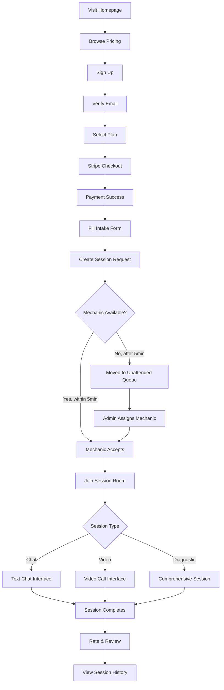
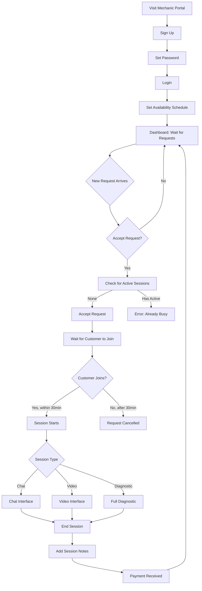
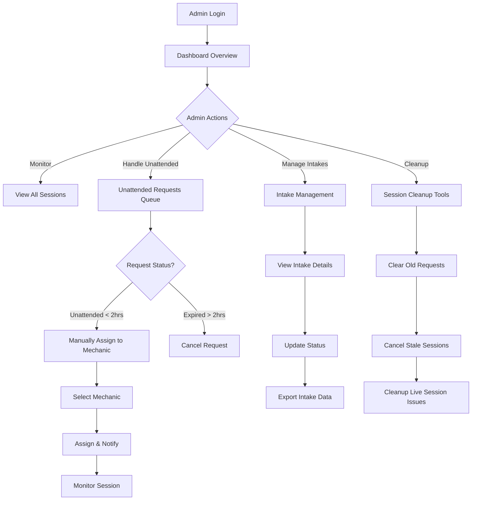
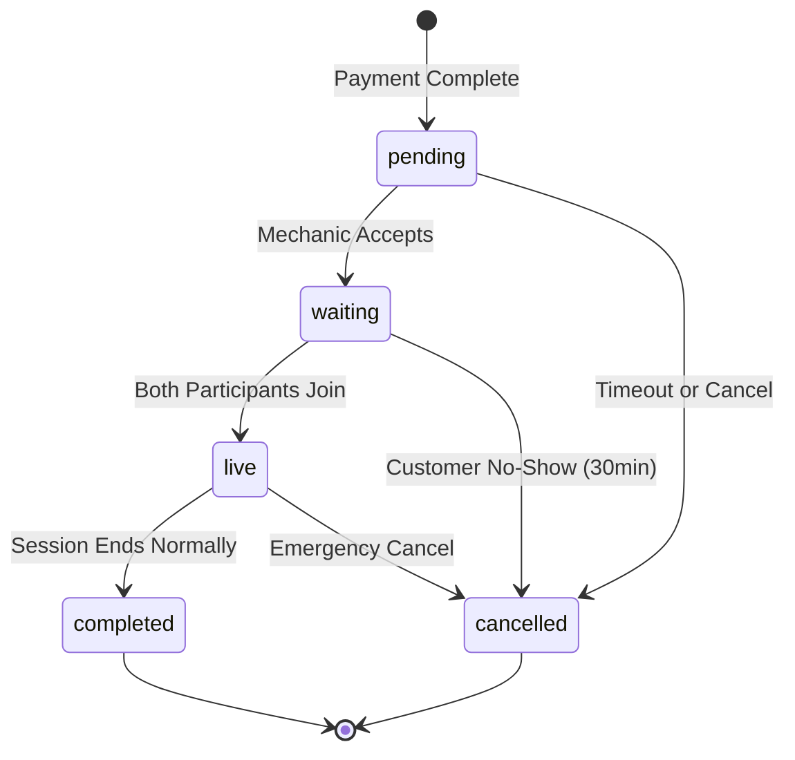
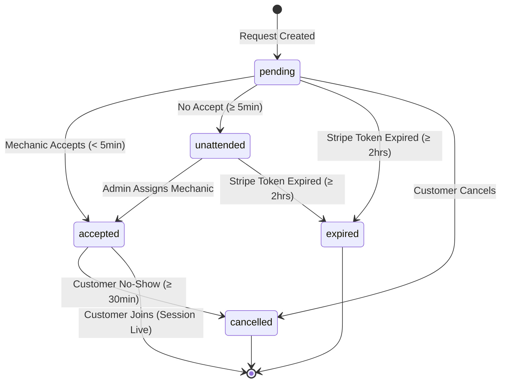
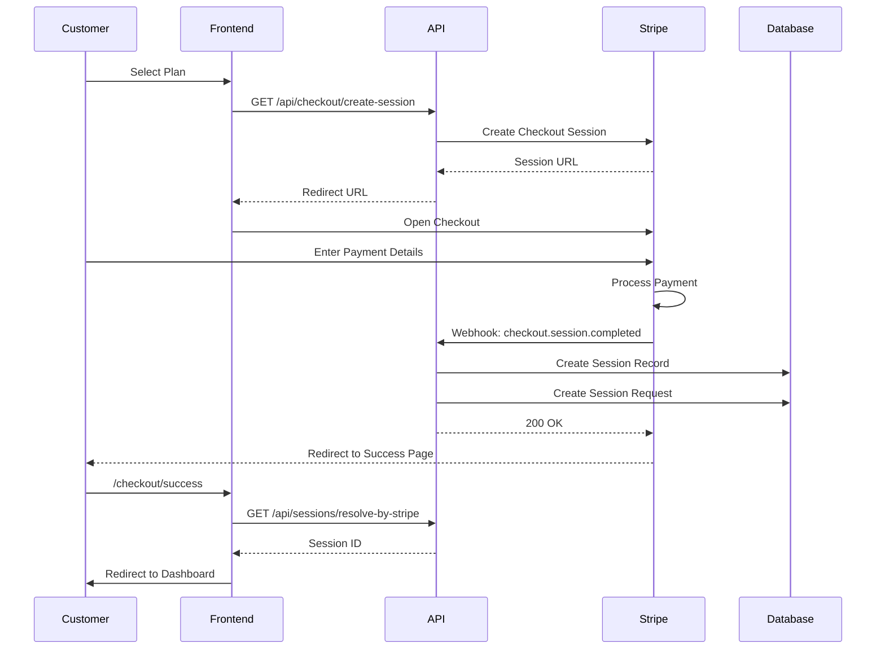

# Auto Doctor - Comprehensive Project Documentation

**Version:** 1.0
**Last Updated:** October 23, 2025
**Project:** Real-time automotive diagnostic consultation platform

---

## Table of Contents

1. [Project Overview](#1-project-overview)
2. [Architecture](#2-architecture)
3. [User Roles and Journeys](#3-user-roles-and-journeys)
4. [Component Architecture](#4-component-architecture)
5. [API Endpoints](#5-api-endpoints)
6. [Database Schema](#6-database-schema)
7. [Session Types and Flow](#7-session-types-and-flow)
8. [Business Logic](#8-business-logic)
9. [Key Features](#9-key-features)
10. [Environment and Configuration](#10-environment-and-configuration)

---

## 1. Project Overview

### 1.1 Purpose and Business Model

**Auto Doctor** is a real-time automotive consultation platform that connects vehicle owners with certified mechanics through text chat, video calls, and comprehensive diagnostic sessions. The platform provides on-demand expert automotive advice without the need for in-person visits.

**Business Model:**
- Pay-per-session pricing (no subscriptions)
- Three service tiers: Quick Chat ($9.99), Standard Video ($29.99), Full Diagnostic ($49.99)
- Revenue split with mechanics via Stripe Connect
- Real-time matching system with automated fallback to admin assignment

### 1.2 Tech Stack

| Category | Technology | Purpose |
|----------|-----------|---------|
| **Framework** | Next.js 14 (App Router) | Full-stack React framework with server components |
| **Language** | TypeScript | Type-safe development |
| **Database** | Supabase (PostgreSQL) | Backend-as-a-Service with real-time capabilities |
| **Authentication** | Supabase Auth | Multi-role authentication system |
| **Payments** | Stripe (Checkout + Connect) | Payment processing and mechanic payouts |
| **Video/Chat** | LiveKit | Real-time video conferencing and data channels |
| **Real-time** | Supabase Realtime | Live updates for sessions and requests |
| **Styling** | Tailwind CSS | Utility-first CSS framework |
| **Email** | Resend | Transactional email service |
| **Deployment** | Vercel | Cloud hosting and CI/CD |

**Key Dependencies:**
```json
{
  "@livekit/components-react": "^2.9.15",
  "livekit-server-sdk": "^2.14.0",
  "@supabase/supabase-js": "^2.75.1",
  "stripe": "^19.1.0",
  "next": "^14.2.11",
  "framer-motion": "^11.18.2"
}
```

### 1.3 Key Features

1. **Three Service Tiers**
   - Quick Chat: 30-minute text consultation
   - Standard Video: 45-minute HD video session
   - Full Diagnostic: 60-minute comprehensive analysis

2. **Multi-Role System**
   - Customers: Request and join sessions
   - Mechanics: Accept requests and provide service
   - Admins: Monitor and manually assign unattended requests

3. **Real-Time Matching**
   - Instant broadcast of new session requests to all available mechanics
   - First-come-first-served acceptance model
   - 5-minute timeout to admin queue if no mechanic accepts

4. **Integrated Communication**
   - LiveKit-powered video conferencing
   - Real-time text chat with file sharing
   - Session recording and transcript

5. **Payment Integration**
   - Stripe Checkout for customer payments
   - Stripe Connect for mechanic payouts
   - Automatic fund distribution

---

## 2. Architecture

### 2.1 Application Structure

The project uses Next.js 14 App Router with the following structure:

```
theautodoctor/
├── src/
│   ├── app/                    # Next.js App Router pages
│   │   ├── (root)/            # Public pages (homepage, pricing)
│   │   ├── admin/             # Admin dashboard and tools
│   │   ├── api/               # API route handlers
│   │   ├── customer/          # Customer-specific pages
│   │   ├── mechanic/          # Mechanic-specific pages
│   │   ├── chat/              # Chat session interface
│   │   ├── video/             # Video session interface
│   │   ├── diagnostic/        # Diagnostic session interface
│   │   └── layout.tsx         # Root layout
│   ├── components/            # React components
│   │   ├── admin/            # Admin-specific components
│   │   ├── customer/         # Customer-specific components
│   │   ├── mechanic/         # Mechanic-specific components
│   │   ├── session/          # Session-related components
│   │   ├── chat/             # Chat UI components
│   │   └── ui/               # Shared UI primitives
│   ├── lib/                   # Utility libraries
│   │   ├── auth.ts           # Authentication utilities
│   │   ├── supabaseServer.ts # Server-side Supabase client
│   │   ├── supabaseAdmin.ts  # Admin Supabase client
│   │   ├── stripe.ts         # Stripe initialization
│   │   ├── livekit.ts        # LiveKit token generation
│   │   ├── sessionRequests.ts # Session request utilities
│   │   └── sessionCleanup.ts # Cleanup utilities
│   ├── types/                 # TypeScript type definitions
│   │   ├── supabase.ts       # Database types
│   │   └── session.ts        # Session-related types
│   ├── config/               # Configuration files
│   │   └── pricing.ts        # Plan definitions and pricing
│   └── middleware.ts         # Route protection middleware
├── supabase/                  # Database migrations and schemas
│   ├── migrations/
│   └── schema.sql
├── public/                    # Static assets
└── package.json
```

### 2.2 Database Schema

#### Core Tables

**sessions** - Active consultation sessions
```sql
CREATE TABLE sessions (
  id UUID PRIMARY KEY DEFAULT gen_random_uuid(),
  created_at TIMESTAMPTZ NOT NULL DEFAULT now(),
  updated_at TIMESTAMPTZ NOT NULL DEFAULT now(),
  plan TEXT NOT NULL,
  type session_type NOT NULL, -- 'chat' | 'video' | 'diagnostic'
  status TEXT, -- 'pending' | 'waiting' | 'live' | 'completed' | 'cancelled'
  stripe_session_id TEXT NOT NULL,
  intake_id UUID REFERENCES intakes(id),
  customer_user_id UUID REFERENCES auth.users(id),
  mechanic_id UUID REFERENCES auth.users(id),
  scheduled_start TIMESTAMPTZ,
  scheduled_end TIMESTAMPTZ,
  scheduled_for TIMESTAMPTZ,
  started_at TIMESTAMPTZ,
  ended_at TIMESTAMPTZ,
  duration_minutes INTEGER,
  waiver_accepted BOOLEAN DEFAULT false,
  waiver_accepted_at TIMESTAMPTZ,
  waiver_ip_address TEXT,
  vehicle_info JSONB DEFAULT '{}'::jsonb,
  session_notes TEXT,
  rating INTEGER CHECK (rating >= 1 AND rating <= 5),
  review TEXT,
  metadata JSONB DEFAULT '{}'::jsonb
);
```

**session_requests** - Pending session requests for mechanic matching
```sql
CREATE TABLE session_requests (
  id UUID PRIMARY KEY DEFAULT gen_random_uuid(),
  created_at TIMESTAMPTZ NOT NULL DEFAULT now(),
  updated_at TIMESTAMPTZ NOT NULL DEFAULT now(),
  customer_id UUID NOT NULL REFERENCES auth.users(id),
  mechanic_id UUID REFERENCES auth.users(id),
  session_type session_type NOT NULL,
  plan_code TEXT NOT NULL,
  status TEXT NOT NULL, -- 'pending' | 'accepted' | 'cancelled' | 'unattended' | 'expired'
  customer_name TEXT,
  customer_email TEXT,
  notes TEXT,
  accepted_at TIMESTAMPTZ,
  notification_sent_at TIMESTAMPTZ,
  metadata JSONB DEFAULT '{}'::jsonb
);
```

**session_participants** - Tracks who is in each session
```sql
CREATE TABLE session_participants (
  id UUID PRIMARY KEY DEFAULT gen_random_uuid(),
  created_at TIMESTAMPTZ NOT NULL DEFAULT now(),
  session_id UUID NOT NULL REFERENCES sessions(id) ON DELETE CASCADE,
  user_id UUID NOT NULL REFERENCES auth.users(id) ON DELETE CASCADE,
  role session_participant_role NOT NULL, -- 'customer' | 'mechanic'
  metadata JSONB DEFAULT '{}'::jsonb,
  UNIQUE(session_id, user_id)
);
```

**intakes** - Customer intake forms with vehicle and problem details
```sql
CREATE TABLE intakes (
  id UUID PRIMARY KEY DEFAULT gen_random_uuid(),
  created_at TIMESTAMPTZ NOT NULL DEFAULT now(),
  updated_at TIMESTAMPTZ,
  plan TEXT,
  status intake_status, -- 'new' | 'pending' | 'in_review' | 'in_progress' | 'resolved' | 'cancelled'
  name TEXT,
  email TEXT,
  phone TEXT,
  city TEXT,
  vin TEXT,
  year TEXT,
  make TEXT,
  model TEXT,
  vehicle_year INTEGER,
  vehicle_make TEXT,
  vehicle_model TEXT,
  odometer TEXT,
  plate TEXT,
  concern TEXT,
  details TEXT,
  notes TEXT,
  plan_details JSONB,
  files JSONB DEFAULT '[]'::jsonb,
  attachments JSONB,
  media_paths JSONB,
  customer_name TEXT,
  customer_email TEXT,
  customer_phone TEXT,
  metadata JSONB
);
```

**profiles** - User profile data (extends auth.users)
```sql
CREATE TABLE profiles (
  id UUID PRIMARY KEY REFERENCES auth.users(id) ON DELETE CASCADE,
  created_at TIMESTAMPTZ NOT NULL DEFAULT now(),
  updated_at TIMESTAMPTZ NOT NULL DEFAULT now(),
  full_name TEXT,
  phone TEXT,
  role TEXT, -- 'customer' | 'mechanic' | 'admin'
  vehicle_info JSONB,
  vehicle_hint TEXT,
  is_18_plus BOOLEAN DEFAULT false,
  waiver_accepted BOOLEAN DEFAULT false,
  waiver_accepted_at TIMESTAMPTZ,
  waiver_ip_address TEXT,
  terms_accepted BOOLEAN DEFAULT false,
  terms_accepted_at TIMESTAMPTZ,
  email_verified BOOLEAN,
  account_status TEXT,
  preferred_plan TEXT,
  last_selected_slot TEXT,
  date_of_birth TEXT,
  stripe_account_id TEXT,
  stripe_onboarding_completed BOOLEAN,
  stripe_charges_enabled BOOLEAN,
  stripe_payouts_enabled BOOLEAN,
  stripe_details_submitted BOOLEAN,
  metadata JSONB
);
```

**mechanics** - Separate authentication table for mechanics (custom auth)
```sql
CREATE TABLE mechanics (
  id UUID PRIMARY KEY DEFAULT gen_random_uuid(),
  created_at TIMESTAMPTZ NOT NULL DEFAULT now(),
  name TEXT,
  email TEXT NOT NULL UNIQUE,
  phone TEXT,
  password_hash TEXT NOT NULL,
  stripe_account_id TEXT,
  stripe_onboarding_completed BOOLEAN,
  stripe_charges_enabled BOOLEAN,
  stripe_payouts_enabled BOOLEAN,
  stripe_details_submitted BOOLEAN
);
```

**mechanic_sessions** - Custom session tokens for mechanic authentication
```sql
CREATE TABLE mechanic_sessions (
  id UUID PRIMARY KEY DEFAULT gen_random_uuid(),
  created_at TIMESTAMPTZ NOT NULL DEFAULT now(),
  expires_at TIMESTAMPTZ NOT NULL,
  mechanic_id UUID NOT NULL REFERENCES mechanics(id),
  token TEXT NOT NULL UNIQUE
);
```

**mechanic_availability** - Weekly availability schedules
```sql
CREATE TABLE mechanic_availability (
  id UUID PRIMARY KEY DEFAULT gen_random_uuid(),
  created_at TIMESTAMPTZ NOT NULL DEFAULT now(),
  updated_at TIMESTAMPTZ NOT NULL DEFAULT now(),
  mechanic_id UUID NOT NULL REFERENCES auth.users(id) ON DELETE CASCADE,
  day_of_week INTEGER NOT NULL CHECK (day_of_week >= 0 AND day_of_week <= 6),
  start_time TIME NOT NULL,
  end_time TIME NOT NULL,
  is_available BOOLEAN DEFAULT true,
  UNIQUE(mechanic_id, day_of_week, start_time)
);
```

**session_files** - File uploads during sessions
```sql
CREATE TABLE session_files (
  id UUID PRIMARY KEY DEFAULT gen_random_uuid(),
  created_at TIMESTAMPTZ NOT NULL DEFAULT now(),
  session_id UUID NOT NULL REFERENCES sessions(id) ON DELETE CASCADE,
  uploaded_by UUID NOT NULL REFERENCES auth.users(id) ON DELETE CASCADE,
  file_name TEXT NOT NULL,
  file_size INTEGER NOT NULL,
  file_type TEXT NOT NULL,
  storage_path TEXT NOT NULL,
  file_url TEXT,
  description TEXT,
  metadata JSONB DEFAULT '{}'::jsonb
);
```

**chat_messages** - Text messages in chat sessions
```sql
CREATE TABLE chat_messages (
  id UUID PRIMARY KEY DEFAULT gen_random_uuid(),
  created_at TIMESTAMPTZ NOT NULL DEFAULT now(),
  session_id UUID NOT NULL REFERENCES sessions(id) ON DELETE CASCADE,
  sender_id UUID NOT NULL REFERENCES auth.users(id),
  content TEXT NOT NULL,
  attachments JSONB DEFAULT '[]'::jsonb
);
```

**vehicles** - Customer vehicle registry
```sql
CREATE TABLE vehicles (
  id UUID PRIMARY KEY DEFAULT gen_random_uuid(),
  created_at TIMESTAMPTZ NOT NULL DEFAULT now(),
  user_id UUID NOT NULL REFERENCES auth.users(id) ON DELETE CASCADE,
  make TEXT NOT NULL,
  model TEXT NOT NULL,
  year TEXT NOT NULL,
  vin TEXT,
  color TEXT,
  mileage TEXT,
  plate TEXT,
  is_primary BOOLEAN DEFAULT false,
  nickname TEXT
);
```

**waiver_acceptances** - Legal waiver tracking
```sql
CREATE TABLE waiver_acceptances (
  id UUID PRIMARY KEY DEFAULT gen_random_uuid(),
  created_at TIMESTAMPTZ NOT NULL DEFAULT now(),
  user_id UUID NOT NULL REFERENCES auth.users(id),
  waiver_version TEXT DEFAULT 'v1.0',
  ip_address TEXT,
  user_agent TEXT,
  metadata JSONB
);
```

#### Database Relationships



### 2.3 Authentication System

The platform uses a **three-tier authentication system** to support different user roles:

#### 2.3.1 Customer Authentication (Supabase Auth)

- **Provider:** Supabase Auth (email/password)
- **Storage:** `auth.users` table + `profiles` table
- **Cookie:** Supabase session cookies (managed by Supabase SSR)
- **Flow:**
  1. Customer signs up via `/api/customer/signup`
  2. Account created in `auth.users` with `role: 'customer'` in metadata
  3. Profile row automatically created via database trigger
  4. Email verification required before accessing protected routes
  5. Middleware checks `auth.getUser()` for customer routes

**Customer Signup Code Example:**
```typescript
// src/app/api/customer/signup/route.ts
const { data: authData, error: authError } = await supabaseAdmin.auth.admin.createUser({
  email,
  password,
  email_confirm: false,
  user_metadata: {
    full_name: fullName,
    phone,
    role: 'customer',
  },
})
```

#### 2.3.2 Mechanic Authentication (Custom System)

- **Provider:** Custom password-based authentication
- **Storage:** `mechanics` table + `mechanic_sessions` table
- **Cookie:** `aad_mech` (custom HTTP-only cookie)
- **Flow:**
  1. Mechanic signs up via `/api/mechanics/signup`
  2. Password hashed with bcrypt and stored in `mechanics` table
  3. Login creates session token stored in `mechanic_sessions`
  4. Token stored in `aad_mech` cookie (30-day expiry)
  5. Middleware checks cookie presence for mechanic routes
  6. API routes validate token against `mechanic_sessions` table

**Why Custom Auth for Mechanics?**
- Separate authentication system prevents role confusion
- Allows different session management policies
- Simplified mechanic onboarding without email verification
- Clear separation of concerns between customer and provider roles

**Mechanic Login Code Example:**
```typescript
// src/app/api/mechanics/login/route.ts
const ok = verifyPassword(password, mech.password_hash)
if (!ok) return bad('Invalid credentials', 401)

const token = makeSessionToken()
const expires = new Date(Date.now() + 1000*60*60*24*30)
await supabaseAdmin.from('mechanic_sessions').insert({
  mechanic_id: mech.id,
  token,
  expires_at: expires.toISOString(),
})

res.cookies.set('aad_mech', token, {
  httpOnly: true,
  sameSite: 'lax',
  secure: process.env.NODE_ENV === 'production',
  path: '/',
  maxAge: 60*60*24*30,
})
```

#### 2.3.3 Admin Authentication (Supabase Auth)

- **Provider:** Supabase Auth (email/password)
- **Storage:** `auth.users` table + `profiles` table with `role: 'admin'`
- **Cookie:** Supabase session cookies
- **Flow:**
  1. Admin accounts created manually via Supabase dashboard
  2. Login via `/api/admin/login`
  3. Middleware checks `auth.getUser()` for admin routes
  4. Future: Add role-based access control checks

### 2.4 Real-Time Features

#### 2.4.1 Supabase Realtime

Used for broadcasting session request updates to mechanics:

**Broadcasting New Requests:**
```typescript
// src/lib/sessionRequests.ts
export async function broadcastSessionRequest(
  event: 'new_request' | 'request_accepted' | 'request_cancelled',
  payload: Record<string, unknown>
) {
  const channel = supabaseAdmin.channel('session_requests_feed')
  await channel.send({
    type: 'broadcast',
    event,
    payload,
  })
}
```

**Mechanic Dashboard Subscription:**
```typescript
// Mechanics subscribe to session_requests_feed channel
const channel = supabase.channel('session_requests_feed')
channel.on('broadcast', { event: 'new_request' }, (payload) => {
  // Add new request to UI
})
```

#### 2.4.2 LiveKit Real-Time Communication

**Token Generation:**
```typescript
// src/lib/livekit.ts
const accessToken = new AccessToken(apiKey, apiSecret, {
  identity,
  metadata: JSON.stringify(metadata),
})

accessToken.addGrant({
  room,
  roomJoin: true,
  canPublish: true,
  canSubscribe: true,
  canPublishData: true,
})

const token = await accessToken.toJwt()
```

**Video Session:**
- HD video and audio streaming
- Screen sharing capabilities
- Data channels for real-time events (timer sync, participant actions)

**Chat Session:**
- Text messaging via data channels
- File sharing via session_files table + Supabase Storage
- Message persistence in chat_messages table

### 2.5 Payment Processing

#### 2.5.1 Stripe Checkout (Customer Payments)

**Checkout Flow:**


**Implementation:**
```typescript
// src/app/api/checkout/create-session/route.ts
const session = await stripe.checkout.sessions.create({
  mode: 'payment',
  line_items: [{ price: cfg.stripePriceId, quantity: 1 }],
  success_url: `${origin}/checkout/success?session_id={CHECKOUT_SESSION_ID}`,
  cancel_url: `${origin}/pricing`,
  metadata: {
    plan: key,
    supabase_user_id: user.id,
    customer_email: user.email,
  },
})
```

#### 2.5.2 Stripe Connect (Mechanic Payouts)

**Onboarding Flow:**
1. Mechanic clicks "Setup Payouts" in dashboard
2. API creates Stripe Connect Account
3. Redirect to Stripe onboarding form
4. Stripe returns to success URL
5. Account status saved in `profiles` table

**Future Implementation:**
- Automatic payment splits after session completion
- 80/20 revenue split (80% to mechanic, 20% platform fee)
- Weekly automatic payouts to mechanic bank accounts

---

## 3. User Roles and Journeys

### 3.1 Customer Journey



**Step-by-Step Breakdown:**

1. **Discovery & Signup**
   - URL: `/` (homepage), `/pricing`
   - Action: Customer browses service offerings
   - Route: `/signup` → `/api/customer/signup`

2. **Email Verification**
   - Email sent by Supabase Auth
   - Customer clicks verification link
   - Route: `/auth/callback` handles confirmation code

3. **Plan Selection**
   - URL: `/pricing`
   - Options: Quick Chat ($9.99), Standard Video ($29.99), Full Diagnostic ($49.99)
   - Action: Click "Get Started" button

4. **Payment**
   - Route: `/api/checkout/create-session?plan=chat10`
   - Redirects to Stripe Checkout
   - On success: `/checkout/success?session_id=XXX`

5. **Intake Form**
   - URL: `/intake`
   - Customer provides:
     - Vehicle information (VIN, year, make, model)
     - Problem description
     - Photos/videos (optional)
   - Route: `/api/intake/start`

6. **Session Request Creation**
   - Automatic after successful payment
   - Creates entry in `session_requests` table (status: 'pending')
   - Creates entry in `sessions` table (status: 'waiting')
   - Broadcasts to all mechanics via Supabase Realtime

7. **Waiting for Mechanic**
   - URL: `/customer/dashboard`
   - Real-time status updates
   - Two outcomes:
     - **Fast match (< 5 min):** Mechanic accepts, customer notified
     - **Timeout (≥ 5 min):** Request marked 'unattended', visible to admin

8. **Join Session**
   - URL: `/chat/[sessionId]` or `/video/[sessionId]` or `/diagnostic/[sessionId]`
   - LiveKit token generated
   - Session status changes to 'live'

9. **Complete Session**
   - Mechanic or customer ends session
   - Session status changes to 'completed'
   - URL: `/session/complete?sessionId=XXX`

10. **Post-Session**
    - Customer rates mechanic (1-5 stars)
    - Optional written review
    - Access session recording/transcript
    - URL: `/customer/dashboard` (history view)

### 3.2 Mechanic Journey



**Step-by-Step Breakdown:**

1. **Signup & Login**
   - URL: `/mechanic/signup`, `/mechanic/login`
   - Routes: `/api/mechanics/signup`, `/api/mechanics/login`
   - Custom authentication (not Supabase Auth)
   - Cookie: `aad_mech`

2. **Set Availability**
   - URL: `/mechanic/availability`
   - Define weekly schedule (day of week, start time, end time)
   - Route: `/api/mechanics/availability` (POST)

3. **Dashboard Monitoring**
   - URL: `/mechanic/dashboard`
   - Real-time subscription to `session_requests_feed` channel
   - Shows pending requests with customer info and intake details

4. **Accept Request**
   - Action: Click "Accept" button on request card
   - Route: `/api/mechanics/requests/[id]/accept` (POST)
   - **Business Rule:** Mechanic can only have ONE accepted request at a time
   - Checks:
     - No other active sessions for this mechanic
     - No other accepted requests for this mechanic
   - If check fails, acceptance is rolled back

5. **Wait for Customer**
   - Status: Request is 'accepted', session is 'waiting'
   - Timeout: 30 minutes
   - If customer doesn't join within 30 minutes, request is auto-cancelled

6. **Join Session**
   - URL: `/chat/[sessionId]` or `/video/[sessionId]` or `/diagnostic/[sessionId]`
   - Same interface as customer, but with mechanic role
   - LiveKit token generated with mechanic identity

7. **Conduct Session**
   - Provide diagnostic advice
   - Share screen (video sessions)
   - Upload/view files (photos, scan data, receipts)
   - Real-time timer shows remaining session time

8. **End Session**
   - Action: Click "End Session" button
   - Route: `/api/sessions/[id]/end` (POST)
   - Session status changes to 'completed'
   - Add session notes for customer

9. **Payment**
   - Automatic after session completion (future implementation)
   - Funds transferred via Stripe Connect
   - 80% to mechanic, 20% platform fee

10. **Session History**
    - URL: `/mechanic/dashboard` (history tab)
    - View all past sessions
    - Access session notes and recordings

### 3.3 Admin Journey



**Step-by-Step Breakdown:**

1. **Login**
   - URL: `/admin/login`
   - Route: `/api/admin/login` (POST)
   - Supabase Auth with admin role

2. **Dashboard Overview**
   - URL: `/admin` (redirects to `/admin/intakes`)
   - Metrics:
     - Total sessions today
     - Active sessions
     - Unattended requests
     - Intake submissions

3. **Unattended Requests**
   - URL: `/admin/unattended`
   - Shows requests that timed out (no mechanic accepted within 5 minutes)
   - Status filter: 'unattended' (< 2 hours), 'expired' (> 2 hours)

4. **Manual Assignment**
   - Action: Click "Assign" button on unattended request
   - Route: `/api/admin/requests/[id]/assign` (POST)
   - Select mechanic from dropdown
   - Creates session and notifies customer

5. **Intake Management**
   - URL: `/admin/intakes`
   - View all customer intake forms
   - Filter by status, date, plan
   - Export to CSV
   - Routes:
     - `/api/admin/intakes/query` (GET)
     - `/api/admin/intakes/export` (GET)
     - `/api/admin/intakes/[id]/status` (PATCH)

6. **Session Monitoring**
   - URL: `/admin/sessions`
   - View all sessions (live, completed, cancelled)
   - Join active sessions as observer
   - Route: `/api/admin/sessions/join` (POST)

7. **Cleanup Tools**
   - URL: `/admin/cleanup`
   - Manual trigger for cleanup operations:
     - Clear old waiting sessions (> 15 minutes)
     - Mark unattended requests (> 5 minutes)
     - Expire old Stripe tokens (> 2 hours)
     - Cancel accepted requests with no customer join (> 30 minutes)
   - Route: `/api/debug/cleanup-sessions` (POST)

---

## 4. Component Architecture

### 4.1 Directory Structure

```
src/components/
├── admin/
│   ├── IntakeList.tsx          # List of intake forms
│   ├── IntakeDetails.tsx       # Single intake detail view
│   ├── UnattendedQueue.tsx     # Unattended request queue
│   └── SessionMonitor.tsx      # Live session monitoring
├── customer/
│   ├── Dashboard.tsx           # Customer dashboard
│   ├── SessionHistory.tsx      # Past sessions
│   ├── IntakeForm.tsx          # Vehicle intake form
│   └── PlanSelector.tsx        # Service plan selection
├── mechanic/
│   ├── Dashboard.tsx           # Mechanic dashboard
│   ├── RequestCard.tsx         # Session request card
│   ├── AvailabilitySchedule.tsx # Weekly availability editor
│   └── SessionHistory.tsx      # Past sessions
├── session/
│   ├── SessionTimer.tsx        # Countdown timer
│   ├── SessionControls.tsx     # End session, extend time
│   ├── FileUpload.tsx          # File upload component
│   └── SessionNotes.tsx        # Session notes editor
├── chat/
│   ├── ChatInterface.tsx       # Main chat UI
│   ├── MessageList.tsx         # Message history
│   ├── MessageInput.tsx        # Text input with attachments
│   └── ChatBubble.tsx          # Floating minimizable chat
├── realtime/
│   ├── RealtimeProvider.tsx    # Supabase Realtime context
│   └── LiveKitRoom.tsx         # LiveKit room wrapper
├── ui/
│   ├── Button.tsx              # Reusable button
│   ├── Input.tsx               # Form input
│   ├── Modal.tsx               # Modal dialog
│   ├── Toast.tsx               # Toast notifications
│   └── LoadingSpinner.tsx      # Loading indicator
└── layout/
    ├── Header.tsx              # Site header
    ├── Footer.tsx              # Site footer
    ├── Sidebar.tsx             # Dashboard sidebar
    └── MobileNav.tsx           # Mobile navigation
```

### 4.2 Key Components

#### 4.2.1 SessionTimer Component

**Purpose:** Display countdown timer during active sessions with visual warnings.

**Props:**
```typescript
interface SessionTimerProps {
  sessionId: string
  durationMinutes: number
  startedAt: string
  onTimeExpired: () => void
}
```

**Features:**
- Real-time countdown using `useEffect` with 1-second interval
- Color changes:
  - Green: > 5 minutes remaining
  - Yellow: 1-5 minutes remaining
  - Red: < 1 minute remaining
- Audio/visual warning at 5 minutes and 1 minute
- Auto-triggers session end at 0:00

#### 4.2.2 ChatInterface Component

**Purpose:** Unified chat interface for text-based consultations.

**Features:**
- Message list with auto-scroll to bottom
- Rich text input with file attachments
- Real-time message delivery via Supabase Realtime
- Typing indicators
- Message persistence in `chat_messages` table
- File preview for images and PDFs

#### 4.2.3 RequestCard Component (Mechanic Dashboard)

**Purpose:** Display pending session request with quick actions.

**Features:**
- Customer name and contact info
- Vehicle details (make, model, year)
- Problem description summary
- Attached files/photos
- "Accept" button with loading state
- One-click acceptance with optimistic UI updates

### 4.3 Shared Utilities and Hooks

#### 4.3.1 Custom Hooks

**useSession** - Fetch and subscribe to session updates
```typescript
function useSession(sessionId: string) {
  const [session, setSession] = useState<Session | null>(null)
  const [loading, setLoading] = useState(true)

  useEffect(() => {
    // Fetch initial session data
    // Subscribe to real-time updates
    // Cleanup on unmount
  }, [sessionId])

  return { session, loading }
}
```

**useMechanicAuth** - Validate mechanic authentication
```typescript
function useMechanicAuth() {
  const [mechanic, setMechanic] = useState<Mechanic | null>(null)
  const [loading, setLoading] = useState(true)

  useEffect(() => {
    // Check mechanic cookie
    // Validate session token
    // Fetch mechanic profile
  }, [])

  return { mechanic, loading, isAuthenticated: !!mechanic }
}
```

**useSupabaseRealtime** - Subscribe to real-time channels
```typescript
function useSupabaseRealtime(channelName: string, event: string, callback: Function) {
  const supabase = useSupabaseClient()

  useEffect(() => {
    const channel = supabase.channel(channelName)
    channel.on('broadcast', { event }, callback)
    channel.subscribe()

    return () => {
      supabase.removeChannel(channel)
    }
  }, [channelName, event])
}
```

#### 4.3.2 Utility Libraries

**src/lib/auth.ts** - Authentication utilities
```typescript
export function hashPassword(password: string): string
export function verifyPassword(password: string, hash: string): boolean
export function makeSessionToken(): string
```

**src/lib/fetcher.ts** - API request wrapper
```typescript
export async function fetcher<T>(url: string, options?: RequestInit): Promise<T>
```

**src/lib/fulfillment.ts** - Session fulfillment logic
```typescript
export async function fulfillSession(stripeSessionId: string): Promise<Session>
export async function checkCustomerSessionStatus(customerId: string): Promise<boolean>
```

### 4.4 Client vs Server Components

**Server Components (default in App Router):**
- Dashboard layouts
- Initial data fetching
- SEO-critical pages
- Static content

**Client Components (marked with `"use client"`):**
- Interactive forms
- Real-time subscriptions
- LiveKit video rooms
- State management with React hooks
- Event handlers

**Example:**
```typescript
// Server Component
export default async function DashboardPage() {
  const supabase = getSupabaseServer()
  const { data: sessions } = await supabase
    .from('sessions')
    .select('*')
    .eq('customer_user_id', userId)

  return <DashboardClient sessions={sessions} />
}

// Client Component
'use client'
export function DashboardClient({ sessions }) {
  // Interactive UI with real-time updates
}
```

---

## 5. API Endpoints

### 5.1 Customer Endpoints

| Method | Endpoint | Purpose | Auth Required |
|--------|----------|---------|---------------|
| POST | `/api/customer/signup` | Create new customer account | No |
| POST | `/api/customer/logout` | Sign out customer | Yes (Customer) |
| POST | `/api/customer/forgot-password` | Request password reset | No |
| GET | `/api/customer/profile` | Fetch customer profile | Yes (Customer) |
| PATCH | `/api/customer/profile` | Update customer profile | Yes (Customer) |
| GET | `/api/customer/bookings` | Get session history | Yes (Customer) |
| POST | `/api/customer/schedule` | Schedule session | Yes (Customer) |
| POST | `/api/customer/clear-plan` | Clear selected plan | Yes (Customer) |

**Example: Customer Signup**
```http
POST /api/customer/signup
Content-Type: application/json

{
  "email": "customer@example.com",
  "password": "securePass123",
  "fullName": "John Doe",
  "phone": "+1234567890",
  "vehicleInfo": {
    "make": "Toyota",
    "model": "Camry",
    "year": "2020"
  },
  "waiverAccepted": true,
  "is18Plus": true
}
```

**Response:**
```json
{
  "success": true,
  "userId": "uuid-here",
  "message": "Account created! Please check your email to verify your account."
}
```

### 5.2 Mechanic Endpoints

| Method | Endpoint | Purpose | Auth Required |
|--------|----------|---------|---------------|
| POST | `/api/mechanics/signup` | Create mechanic account | No |
| POST | `/api/mechanics/login` | Mechanic login | No |
| POST | `/api/mechanics/logout` | Mechanic logout | Yes (Mechanic) |
| GET | `/api/mechanics/requests` | Get pending requests | Yes (Mechanic) |
| POST | `/api/mechanics/requests/[id]/accept` | Accept session request | Yes (Mechanic) |
| POST | `/api/mechanics/requests/[id]/cancel` | Cancel accepted request | Yes (Mechanic) |
| GET | `/api/mechanics/requests/history` | Get completed sessions | Yes (Mechanic) |
| GET | `/api/mechanics/availability` | Get availability schedule | Yes (Mechanic) |
| POST | `/api/mechanics/availability` | Set availability schedule | Yes (Mechanic) |
| POST | `/api/mechanics/stripe/onboard` | Start Stripe onboarding | Yes (Mechanic) |

**Example: Accept Session Request**
```http
POST /api/mechanics/requests/abc123/accept
Cookie: aad_mech=<token>
```

**Response:**
```json
{
  "request": {
    "id": "abc123",
    "customerId": "user-id",
    "customerName": "John Doe",
    "sessionType": "chat",
    "status": "accepted",
    "mechanicId": "mech-id"
  },
  "session": {
    "id": "session-id"
  }
}
```

### 5.3 Admin Endpoints

| Method | Endpoint | Purpose | Auth Required |
|--------|----------|---------|---------------|
| POST | `/api/admin/login` | Admin login | No |
| POST | `/api/admin/logout` | Admin logout | Yes (Admin) |
| GET | `/api/admin/requests` | Get all requests | Yes (Admin) |
| POST | `/api/admin/requests/[id]/assign` | Assign mechanic to request | Yes (Admin) |
| GET | `/api/admin/sessions/join` | Join session as observer | Yes (Admin) |
| GET | `/api/admin/intakes` | List all intakes | Yes (Admin) |
| GET | `/api/admin/intakes/query` | Search/filter intakes | Yes (Admin) |
| GET | `/api/admin/intakes/export` | Export intakes to CSV | Yes (Admin) |
| GET | `/api/admin/intakes/[id]` | Get intake details | Yes (Admin) |
| PATCH | `/api/admin/intakes/[id]/status` | Update intake status | Yes (Admin) |
| POST | `/api/admin/intakes/update-status` | Bulk update intake status | Yes (Admin) |

**Example: Assign Mechanic to Unattended Request**
```http
POST /api/admin/requests/abc123/assign
Content-Type: application/json
Authorization: Bearer <supabase-token>

{
  "mechanicId": "mech-id-123"
}
```

**Response:**
```json
{
  "success": true,
  "request": {
    "id": "abc123",
    "status": "accepted",
    "mechanicId": "mech-id-123"
  }
}
```

### 5.4 Session Management Endpoints

| Method | Endpoint | Purpose | Auth Required |
|--------|----------|---------|---------------|
| POST | `/api/session/start` | Start session timer | Yes |
| POST | `/api/session/extend` | Request time extension | Yes |
| POST | `/api/session/invite` | Invite participant to session | Yes |
| GET | `/api/sessions` | Get user's sessions | Yes |
| GET | `/api/sessions/[id]` | Get session details | Yes |
| POST | `/api/sessions/[id]/start` | Start session | Yes |
| POST | `/api/sessions/[id]/end` | End session | Yes |
| DELETE | `/api/sessions/[id]/delete` | Delete session | Yes (Admin) |
| GET | `/api/sessions/[id]/files` | Get session files | Yes |
| GET | `/api/sessions/resolve-by-stripe` | Resolve session by Stripe ID | Yes |

**Example: End Session**
```http
POST /api/sessions/session-id-123/end
Content-Type: application/json
Authorization: Bearer <supabase-token>

{
  "sessionNotes": "Diagnosed alternator issue. Customer should replace alternator and battery.",
  "rating": 5
}
```

**Response:**
```json
{
  "success": true,
  "session": {
    "id": "session-id-123",
    "status": "completed",
    "endedAt": "2025-10-23T10:30:00Z",
    "durationMinutes": 28
  }
}
```

### 5.5 Payment Endpoints

| Method | Endpoint | Purpose | Auth Required |
|--------|----------|---------|---------------|
| GET | `/api/checkout` | Redirect to Stripe Checkout | Yes (Customer) |
| GET | `/api/checkout/create-session` | Create Stripe Checkout session | Yes (Customer) |
| GET | `/api/checkout/resolve` | Resolve session after payment | Yes (Customer) |
| POST | `/api/stripe/webhook` | Handle Stripe webhooks | No (Stripe signature) |

**Example: Create Checkout Session**
```http
GET /api/checkout/create-session?plan=chat10&intake_id=intake-123
Authorization: Bearer <supabase-token>
```

**Response:**
```
HTTP/1.1 303 See Other
Location: https://checkout.stripe.com/pay/cs_test_...
```

**Stripe Webhook Events:**
- `checkout.session.completed`: Create session record after payment
- `payment_intent.succeeded`: Confirm payment
- `account.updated`: Update mechanic Stripe status

### 5.6 Chat Endpoints

| Method | Endpoint | Purpose | Auth Required |
|--------|----------|---------|---------------|
| POST | `/api/chat/send-message` | Send chat message | Yes |
| GET | `/api/chat/session-info` | Get session chat info | Yes |
| GET | `/api/chat/debug-messages` | Debug message history | Yes (Admin) |

### 5.7 Utility Endpoints

| Method | Endpoint | Purpose | Auth Required |
|--------|----------|---------|---------------|
| GET | `/api/health` | Health check | No |
| POST | `/api/contact` | Contact form submission | No |
| GET | `/api/livekit/token` | Generate LiveKit token | Yes |
| POST | `/api/livekit` | LiveKit webhook handler | No (LiveKit signature) |
| POST | `/api/vin/decode` | Decode VIN number | Yes |
| POST | `/api/uploads/sign` | Sign file upload URL | Yes |
| PUT | `/api/uploads/put` | Upload file to storage | Yes |
| POST | `/api/intake/start` | Submit intake form | Yes |

**Example: Generate LiveKit Token**
```http
GET /api/livekit/token?roomName=session-123&userName=John
Authorization: Bearer <supabase-token>
```

**Response:**
```json
{
  "token": "eyJhbGciOiJIUzI1NiIsInR5cCI6IkpXVCJ9...",
  "serverUrl": "wss://myautodoctorca-oe6r6oqr.livekit.cloud"
}
```

### 5.8 Debug/Admin Utility Endpoints

| Method | Endpoint | Purpose | Auth Required |
|--------|----------|---------|---------------|
| GET | `/api/debug/session-requests` | View all session requests | Yes (Admin) |
| POST | `/api/debug/clear-old-requests` | Clear old requests | Yes (Admin) |
| POST | `/api/debug/reset-broken-requests` | Reset broken requests | Yes (Admin) |
| POST | `/api/debug/force-cancel-session` | Force cancel session | Yes (Admin) |
| POST | `/api/debug/clear-customer-sessions` | Clear customer sessions | Yes (Admin) |
| POST | `/api/debug/cleanup-user-data` | Cleanup user data | Yes (Admin) |
| GET | `/api/debug/session-health` | Check session health | Yes (Admin) |
| POST | `/api/debug/cleanup-sessions` | Run cleanup operations | Yes (Admin) |
| POST | `/api/debug/cleanup-ghost-requests` | Remove ghost requests | Yes (Admin) |
| POST | `/api/debug/cleanup-live-sessions` | Cleanup live sessions | Yes (Admin) |
| POST | `/api/debug/fix-schema` | Fix database schema issues | Yes (Admin) |
| GET | `/api/debug/mechanic-requests` | Debug mechanic requests | Yes (Admin) |

---

## 6. Database Schema

### 6.1 All Tables with Columns and Types

*See Section 2.2 for detailed table schemas*

### 6.2 Key Indexes

```sql
-- Sessions
CREATE INDEX sessions_customer_idx ON sessions(customer_user_id);
CREATE INDEX sessions_mechanic_idx ON sessions(mechanic_id);
CREATE INDEX sessions_status_idx ON sessions(status);
CREATE INDEX sessions_started_at_idx ON sessions(started_at);
CREATE INDEX sessions_scheduled_for_idx ON sessions(scheduled_for);

-- Session Requests
CREATE INDEX session_requests_customer_idx ON session_requests(customer_id);
CREATE INDEX session_requests_mechanic_idx ON session_requests(mechanic_id);
CREATE INDEX session_requests_status_idx ON session_requests(status);
CREATE INDEX session_requests_created_at_idx ON session_requests(created_at);

-- Session Participants
CREATE INDEX session_participants_session_idx ON session_participants(session_id);
CREATE INDEX session_participants_user_idx ON session_participants(user_id);

-- Session Files
CREATE INDEX session_files_session_idx ON session_files(session_id);
CREATE INDEX session_files_uploaded_by_idx ON session_files(uploaded_by);

-- Chat Messages
CREATE INDEX chat_messages_session_idx ON chat_messages(session_id);
CREATE INDEX chat_messages_sender_idx ON chat_messages(sender_id);

-- Mechanic Availability
CREATE INDEX mechanic_availability_mechanic_idx ON mechanic_availability(mechanic_id);
CREATE INDEX mechanic_availability_day_idx ON mechanic_availability(day_of_week);

-- Intakes
CREATE INDEX intakes_status_idx ON intakes(status);
CREATE INDEX intakes_created_at_idx ON intakes(created_at);
CREATE INDEX intakes_email_idx ON intakes(email);
```

### 6.3 Enums and Constraints

**session_type enum:**
```sql
CREATE TYPE session_type AS ENUM ('chat', 'video', 'diagnostic');
```

**session_participant_role enum:**
```sql
CREATE TYPE session_participant_role AS ENUM ('customer', 'mechanic');
```

**intake_status enum:**
```sql
CREATE TYPE intake_status AS ENUM (
  'new',
  'pending',
  'in_review',
  'in_progress',
  'awaiting_customer',
  'resolved',
  'cancelled'
);
```

**Session Status Values:**
- `pending`: Created, payment complete, waiting for assignment
- `waiting`: Mechanic assigned, waiting for both to join
- `live`: Session in progress
- `completed`: Session finished successfully
- `cancelled`: Session cancelled before completion

**Session Request Status Values:**
- `pending`: Broadcast to mechanics, waiting for acceptance (< 5 minutes)
- `accepted`: Mechanic accepted, waiting for customer to join (< 30 minutes)
- `unattended`: No mechanic accepted within 5 minutes (admin queue)
- `expired`: Stripe token expired after 2 hours
- `cancelled`: Manually cancelled or auto-cancelled

---

## 7. Session Types and Flow

### 7.1 Session Types

#### 7.1.1 Quick Chat (30 minutes, $9.99)

**Plan Code:** `chat10`
**Stripe Price ID:** `process.env.STRIPE_PRICE_CHAT10`
**Fulfillment:** Text-based chat interface

**Features:**
- Private text workspace
- Photo/video sharing via file upload
- Real-time messaging
- Action plan delivered before session ends
- No video required

**Use Cases:**
- Quick questions ("Is this noise normal?")
- Second opinions on quotes
- Basic troubleshooting
- Triage before deciding on video session

#### 7.1.2 Standard Video (45 minutes, $29.99)

**Plan Code:** `video15`
**Stripe Price ID:** `process.env.STRIPE_PRICE_VIDEO15`
**Fulfillment:** HD video call with screen sharing

**Features:**
- HD video and audio streaming
- Screen sharing (mechanic can share repair diagrams)
- Guided visual inspections
- Real-time chat sidebar
- Session recording (future)
- File sharing during call

**Use Cases:**
- Visual diagnosis ("Show me the leak")
- Step-by-step repair guidance
- Complex troubleshooting
- Pre-purchase inspections

#### 7.1.3 Full Diagnostic (60 minutes, $49.99)

**Plan Code:** `diagnostic`
**Stripe Price ID:** `process.env.STRIPE_PRICE_DIAGNOSTIC`
**Fulfillment:** Comprehensive video session with senior mechanic

**Features:**
- 60-minute deep dive
- Senior/expert mechanic assignment
- Multi-system troubleshooting
- Detailed written summary after session
- Repair priority roadmap
- Cost estimation
- Follow-up support

**Use Cases:**
- Multiple symptoms/problems
- Complex electrical issues
- Engine performance problems
- Pre-repair planning for expensive jobs
- Vehicle health check

### 7.2 Session Lifecycle



**State Definitions:**

| State | Description | Trigger | Timeout |
|-------|-------------|---------|---------|
| `pending` | Session created, waiting for mechanic assignment | Stripe payment success | N/A (request-level timeouts) |
| `waiting` | Mechanic assigned, waiting for customer to join | Mechanic accepts request | 30 minutes |
| `live` | Session in progress, both participants connected | Customer joins room | Plan duration (30/45/60 min) |
| `completed` | Session finished successfully | End button or timer expires | N/A |
| `cancelled` | Session cancelled before completion | Various triggers | N/A |

### 7.3 Session Request Lifecycle

Session requests are separate from sessions and handle the mechanic matching process:



**Request State Definitions:**

| State | Description | Duration | Next State |
|-------|-------------|----------|------------|
| `pending` | Broadcast to all mechanics | 0-5 minutes | `accepted` or `unattended` |
| `accepted` | Mechanic claimed, waiting for customer | 0-30 minutes | Session `live` or `cancelled` |
| `unattended` | No mechanic accepted, in admin queue | 5min - 2hrs | `accepted` (admin assign) or `expired` |
| `expired` | Stripe payment token no longer valid | N/A | Customer must re-request |
| `cancelled` | Request cancelled (various reasons) | N/A | Terminal state |

### 7.4 Two-Tier Timeout System

The platform uses a sophisticated two-tier timeout system to balance real-time service expectations with Stripe payment constraints:

#### Tier 1: Pending → Unattended (5 minutes)

**Business Rule:** Real-time service expectations
**Trigger:** No mechanic accepts within 5 minutes
**Action:** Request marked as `unattended`, moved to admin queue
**Customer Impact:** Notification that request needs manual assignment
**Stripe Status:** Payment token still valid (up to 2 hours)

**Implementation:**
```typescript
// src/lib/sessionCleanup.ts
export async function markUnattendedRequests(maxAgeMinutes: number = 5) {
  const cutoffTime = new Date(Date.now() - maxAgeMinutes * 60 * 1000).toISOString()

  await supabaseAdmin
    .from('session_requests')
    .update({ status: 'unattended' })
    .eq('status', 'pending')
    .is('mechanic_id', null)
    .lt('created_at', cutoffTime)
}
```

#### Tier 2: Unattended → Expired (120 minutes)

**Business Rule:** Stripe Checkout session expiration
**Trigger:** 2 hours after payment (Stripe limit)
**Action:** Request marked as `expired`, payment token invalidated
**Customer Impact:** Must create new request and pay again
**Stripe Status:** Checkout session expired, cannot complete payment

**Implementation:**
```typescript
// src/lib/sessionCleanup.ts
export async function expireOldStripeTokens(maxAgeMinutes: number = 120) {
  const cutoffTime = new Date(Date.now() - maxAgeMinutes * 60 * 1000).toISOString()

  await supabaseAdmin
    .from('session_requests')
    .update({ status: 'expired' })
    .in('status', ['pending', 'unattended'])
    .lt('created_at', cutoffTime)
}
```

#### Additional Timeouts

**Accepted Request Timeout (30 minutes):**
- Customer must join within 30 minutes after mechanic accepts
- If timeout, request auto-cancelled to free up mechanic
- Customer must re-request (payment already captured)

**Waiting Session Cleanup (15 minutes):**
- Orphaned `waiting` sessions without valid requests are cancelled
- Prevents stale sessions from blocking customers

**Comprehensive Cleanup:**
```typescript
// Runs periodically and on-demand
export async function runFullCleanup(): Promise<CleanupStats> {
  await Promise.all([
    markUnattendedRequests(5),      // 5min: pending → unattended
    expireOldStripeTokens(120),     // 2hrs: unattended → expired
    cleanupAcceptedRequests(30),    // 30min: accepted → cancelled
    cleanupOrphanedSessions(60),    // 60min: waiting → cancelled
  ])
}
```

---

## 8. Business Logic

### 8.1 Two-Tier Timeout System

*See Section 7.4 for detailed explanation*

### 8.2 Session Request Cleanup

The platform implements aggressive cleanup to prevent stale data from blocking customers:

**Cleanup Triggers:**
1. **Automatic (Serverless Cron):** Every 5 minutes via Vercel Cron Jobs
2. **On-Demand (API Routes):** Before fetching requests in mechanic dashboard
3. **Manual (Admin Tools):** Admin can trigger cleanup via `/admin/cleanup`

**Cleanup Operations:**

```typescript
// src/lib/sessionCleanup.ts

// 1. Mark unattended requests (5 minutes)
await markUnattendedRequests(5)

// 2. Expire old Stripe tokens (2 hours)
await expireOldStripeTokens(120)

// 3. Cancel old accepted requests (30 minutes)
await cleanupAcceptedRequests(30)

// 4. Cancel orphaned sessions (60 minutes)
await cleanupOrphanedSessions(60)

// 5. Clean customer-specific waiting sessions (15 minutes)
await cleanupCustomerWaitingSessions(customerId, 15)
```

**Statistics Tracked:**
```typescript
interface CleanupStats {
  oldWaitingSessions: number
  expiredRequests: number
  acceptedRequests: number
  orphanedSessions: number
  unattendedRequests: number
  expiredTokens: number
  totalCleaned: number
}
```

### 8.3 Single Session Enforcement for Mechanics

**Business Rule:** A mechanic can only have ONE active or accepted request at a time.

**Enforcement Points:**

1. **On Request Acceptance:**
```typescript
// src/app/api/mechanics/requests/[id]/accept/route.ts

// Check 1: Active sessions
const { data: mechanicActiveSessions } = await supabaseAdmin
  .from('sessions')
  .select('id, status')
  .eq('mechanic_id', mechanic.id)
  .in('status', ['waiting', 'live', 'scheduled'])
  .limit(1)

if (mechanicActiveSessions && mechanicActiveSessions.length > 0) {
  // Rollback acceptance
  await supabaseAdmin
    .from('session_requests')
    .update({ mechanic_id: null, status: 'pending', accepted_at: null })
    .eq('id', requestId)

  return NextResponse.json({
    error: 'You already have an active session. Please complete it before accepting new requests.'
  }, { status: 409 })
}

// Check 2: Other accepted requests
const { data: otherAcceptedRequests } = await supabaseAdmin
  .from('session_requests')
  .select('id')
  .eq('mechanic_id', mechanic.id)
  .eq('status', 'accepted')
  .neq('id', requestId)
  .limit(1)

if (otherAcceptedRequests && otherAcceptedRequests.length > 0) {
  // Rollback acceptance
  return NextResponse.json({
    error: 'You already have an accepted request. Please start that session or cancel it.'
  }, { status: 409 })
}
```

2. **Dashboard UI:**
- "Accept" button disabled if mechanic has active session
- Warning message displayed
- Accepted requests highlighted

**Benefits:**
- Prevents mechanic overload
- Ensures quality service
- Avoids scheduling conflicts
- Clear expectations for mechanics

### 8.4 Payment and Payout Flow

#### 8.4.1 Customer Payment Flow



**Key Steps:**

1. **Checkout Session Creation:**
```typescript
const session = await stripe.checkout.sessions.create({
  mode: 'payment',
  line_items: [{ price: cfg.stripePriceId, quantity: 1 }],
  success_url: `${origin}/checkout/success?session_id={CHECKOUT_SESSION_ID}`,
  cancel_url: `${origin}/pricing`,
  metadata: {
    plan: key,
    supabase_user_id: user.id,
    customer_email: user.email,
  },
})
```

2. **Webhook Processing:**
```typescript
// src/app/api/stripe/webhook/route.ts
if (event.type === 'checkout.session.completed') {
  const session = event.data.object
  const { plan, supabase_user_id } = session.metadata

  // Create session record
  const { data: sessionRecord } = await supabaseAdmin
    .from('sessions')
    .insert({
      customer_user_id: supabase_user_id,
      plan,
      type: getSessionType(plan),
      status: 'pending',
      stripe_session_id: session.id,
    })
    .select()
    .single()

  // Create session request
  await supabaseAdmin
    .from('session_requests')
    .insert({
      customer_id: supabase_user_id,
      session_type: getSessionType(plan),
      plan_code: plan,
      status: 'pending',
    })

  // Broadcast to mechanics
  await broadcastSessionRequest('new_request', {
    requestId: request.id,
    customerName: user.full_name,
    sessionType: getSessionType(plan),
  })
}
```

#### 8.4.2 Mechanic Payout Flow (Future Implementation)

**Current Status:** Stripe Connect accounts created, payouts not automated yet.

**Planned Flow:**
1. Session completes successfully
2. Platform captures payment (already done during checkout)
3. Trigger payout calculation:
   - Customer payment: $29.99
   - Platform fee (20%): $6.00
   - Mechanic payout (80%): $23.99
4. Create Stripe Transfer to mechanic's connected account
5. Update session with payout status
6. Notify mechanic of pending payout

**Implementation:**
```typescript
// Future: src/lib/payouts.ts
async function processMechanicPayout(sessionId: string) {
  const session = await getSession(sessionId)
  const mechanic = await getMechanic(session.mechanic_id)

  // Calculate 80/20 split
  const totalCents = PRICING[session.plan].priceCents
  const platformFeeCents = Math.floor(totalCents * 0.20)
  const mechanicPayoutCents = totalCents - platformFeeCents

  // Create Stripe Transfer
  const transfer = await stripe.transfers.create({
    amount: mechanicPayoutCents,
    currency: 'usd',
    destination: mechanic.stripe_account_id,
    metadata: {
      session_id: sessionId,
      mechanic_id: mechanic.id,
    },
  })

  // Update session
  await supabaseAdmin
    .from('sessions')
    .update({
      metadata: {
        ...session.metadata,
        payout_transfer_id: transfer.id,
        payout_amount: mechanicPayoutCents,
        payout_status: 'completed',
      }
    })
    .eq('id', sessionId)
}
```

### 8.5 Real-Time Request Broadcasting

When a customer pays and creates a request, it's instantly broadcast to all online mechanics:

**Implementation:**
```typescript
// src/lib/sessionRequests.ts
export async function broadcastSessionRequest(
  event: 'new_request' | 'request_accepted' | 'request_cancelled',
  payload: Record<string, unknown>
) {
  const channel = supabaseAdmin.channel('session_requests_feed')

  await new Promise<void>((resolve, reject) => {
    channel.subscribe((status, err) => {
      if (status === 'SUBSCRIBED') resolve()
      else if (status === 'TIMED_OUT' || status === 'CHANNEL_ERROR') reject(err)
    })
  })

  await channel.send({
    type: 'broadcast',
    event,
    payload,
  })

  await channel.unsubscribe()
  supabaseAdmin.removeChannel(channel)
}
```

**Mechanic Subscription:**
```typescript
// Mechanic dashboard component
useEffect(() => {
  const channel = supabase.channel('session_requests_feed')

  channel.on('broadcast', { event: 'new_request' }, (payload) => {
    // Add request to UI
    setRequests(prev => [payload.request, ...prev])
    // Play notification sound
    playNotificationSound()
  })

  channel.on('broadcast', { event: 'request_accepted' }, (payload) => {
    // Remove request from available list
    setRequests(prev => prev.filter(r => r.id !== payload.id))
  })

  channel.subscribe()

  return () => {
    supabase.removeChannel(channel)
  }
}, [])
```

**Benefits:**
- Zero polling (instant updates)
- Scales to many mechanics
- Low server load
- Real-time UI updates

---

## 9. Key Features

### 9.1 Real-Time Chat and Video

**Technology:** LiveKit
**Configuration:** LiveKit Cloud hosted instance

**Features:**
- HD video (up to 1080p)
- Audio with echo cancellation
- Screen sharing (mechanic → customer)
- Data channels for custom events
- Automatic reconnection
- Bandwidth adaptation

**Components:**
```typescript
// src/app/video/[sessionId]/page.tsx
'use client'
import { LiveKitRoom, VideoConference } from '@livekit/components-react'

export default function VideoSessionPage({ params }) {
  const { token, serverUrl } = useLiveKitToken(params.sessionId)

  return (
    <LiveKitRoom
      token={token}
      serverUrl={serverUrl}
      connect={true}
      audio={true}
      video={true}
    >
      <VideoConference />
      <SessionTimer sessionId={params.sessionId} />
      <SessionControls sessionId={params.sessionId} />
    </LiveKitRoom>
  )
}
```

### 9.2 File Upload and Management

**Storage:** Supabase Storage
**Bucket:** `session-files` (private)

**Upload Flow:**
1. Client requests signed URL: `/api/uploads/sign`
2. Client uploads directly to Supabase Storage
3. Client creates file record: `/api/sessions/[id]/files` (POST)
4. File appears in session file list

**Access Control:**
- Only session participants can view files
- RLS policies enforce security
- Public URLs with authentication

**Implementation:**
```typescript
// src/app/api/uploads/sign/route.ts
export async function POST(req: NextRequest) {
  const { fileName, fileSize, fileType, sessionId } = await req.json()

  // Generate unique path
  const filePath = `sessions/${sessionId}/${Date.now()}_${fileName}`

  // Create signed upload URL
  const { data, error } = await supabaseAdmin.storage
    .from('session-files')
    .createSignedUploadUrl(filePath)

  if (error) throw error

  return NextResponse.json({
    uploadUrl: data.signedUrl,
    filePath: filePath,
  })
}
```

### 9.3 VIN Decoding

**Purpose:** Automatically populate vehicle make/model from VIN
**API:** NHTSA VIN Decoder API (free, no key required)

**Implementation:**
```typescript
// src/app/api/vin/decode/route.ts
export async function POST(req: NextRequest) {
  const { vin } = await req.json()

  const response = await fetch(
    `https://vpic.nhtsa.dot.gov/api/vehicles/DecodeVin/${vin}?format=json`
  )

  const data = await response.json()

  return NextResponse.json({
    year: data.Results.find(r => r.Variable === 'Model Year')?.Value,
    make: data.Results.find(r => r.Variable === 'Make')?.Value,
    model: data.Results.find(r => r.Variable === 'Model')?.Value,
  })
}
```

### 9.4 Intake Form System

**Purpose:** Collect vehicle and problem details before session starts

**Fields:**
- Customer info (name, email, phone)
- Vehicle info (VIN, year, make, model, odometer, plate)
- Location (city)
- Problem description
- Photos/videos

**Storage:**
- Main record: `intakes` table
- Files: `intakes.files` JSONB column (array of paths)
- Linked to session via `sessions.intake_id`

**Workflow:**
1. Customer completes payment
2. Redirected to `/intake?session_id=XXX`
3. Fills form, uploads files
4. Submits: `/api/intake/start` (POST)
5. Intake linked to session
6. Mechanic views intake when accepting request

### 9.5 Mechanic Availability Scheduling

**Purpose:** Let mechanics define weekly availability windows

**Data Model:**
```typescript
interface AvailabilityBlock {
  id: string
  mechanic_id: string
  day_of_week: number // 0=Sunday, 6=Saturday
  start_time: string  // "09:00:00"
  end_time: string    // "17:00:00"
  is_available: boolean
}
```

**UI:**
- Weekly calendar view
- Drag to create blocks
- Click to delete
- Toggle active/inactive

**Future Enhancement:**
- Respect availability in request broadcasting
- Only show requests to available mechanics
- Auto-reject if outside availability

### 9.6 Session History and Analytics

**Customer View:**
- List of all past sessions
- Session details (date, mechanic, duration, cost)
- Session notes from mechanic
- Uploaded files
- Ratings/reviews

**Mechanic View:**
- List of completed sessions
- Earnings per session
- Average rating
- Customer feedback
- Session notes

**Admin View:**
- All sessions across all users
- Filter by date, status, plan
- Export to CSV
- Session health monitoring

---

## 10. Environment and Configuration

### 10.1 Required Environment Variables

Create a `.env.local` file in the project root:

```bash
# Next.js
NEXT_PUBLIC_APP_URL=http://localhost:3000

# Supabase
NEXT_PUBLIC_SUPABASE_URL=https://your-project.supabase.co
NEXT_PUBLIC_SUPABASE_ANON_KEY=your-anon-key
SUPABASE_SERVICE_ROLE_KEY=your-service-role-key

# Stripe
STRIPE_SECRET_KEY=sk_test_...
NEXT_PUBLIC_STRIPE_PUBLISHABLE_KEY=pk_test_...
STRIPE_WEBHOOK_SECRET=whsec_...

# Stripe Price IDs (from Stripe Dashboard → Products)
STRIPE_PRICE_CHAT10=price_...
STRIPE_PRICE_VIDEO15=price_...
STRIPE_PRICE_DIAGNOSTIC=price_...

# LiveKit
LIVEKIT_API_KEY=APIxxxxxxxxxxxxxxx
LIVEKIT_API_SECRET=secretxxxxxxxxxxxxxxx
NEXT_PUBLIC_LIVEKIT_URL=wss://your-project.livekit.cloud

# Email (Resend)
RESEND_API_KEY=re_...
RESEND_FROM_EMAIL=noreply@yourdomain.com

# Admin Credentials (for initial setup)
ADMIN_EMAIL=admin@yourdomain.com
ADMIN_PASSWORD=secure-password
```

### 10.2 Stripe Configuration

#### 10.2.1 Create Products and Prices

1. Go to Stripe Dashboard → Products
2. Create three products:
   - **Quick Chat** - $9.99 one-time payment
   - **Standard Video** - $29.99 one-time payment
   - **Full Diagnostic** - $49.99 one-time payment
3. Copy Price IDs (start with `price_`) to `.env.local`

#### 10.2.2 Configure Webhooks

1. Go to Stripe Dashboard → Developers → Webhooks
2. Add endpoint: `https://yourdomain.com/api/stripe/webhook`
3. Select events:
   - `checkout.session.completed`
   - `payment_intent.succeeded`
   - `account.updated` (for Connect)
4. Copy webhook secret to `STRIPE_WEBHOOK_SECRET`

#### 10.2.3 Enable Stripe Connect

1. Go to Stripe Dashboard → Connect → Settings
2. Enable **Standard accounts** (mechanics control their own accounts)
3. Set redirect URLs:
   - Return URL: `https://yourdomain.com/mechanic/onboarding/success`
   - Refresh URL: `https://yourdomain.com/mechanic/onboarding/refresh`

### 10.3 Supabase Setup

#### 10.3.1 Create Project

1. Go to [Supabase Dashboard](https://app.supabase.com/)
2. Create new project
3. Copy URL and keys to `.env.local`

#### 10.3.2 Run Migrations

```bash
# Install Supabase CLI
npm install -g supabase

# Login to Supabase
supabase login

# Link to your project
supabase link --project-ref your-project-ref

# Run all migrations
supabase db push

# Or manually run SQL files in Dashboard → SQL Editor
```

**Key Migration Files:**
- `supabase/migrations/20251020023736_professional_video_session_system.sql` - Main schema
- `supabase/schema.sql` - Additional tables
- `supabase/policies/*.sql` - RLS policies

#### 10.3.3 Enable Realtime

```sql
-- Run in Supabase SQL Editor
ALTER PUBLICATION supabase_realtime ADD TABLE session_requests;
ALTER PUBLICATION supabase_realtime ADD TABLE sessions;
ALTER PUBLICATION supabase_realtime ADD TABLE chat_messages;
```

#### 10.3.4 Create Storage Buckets

```sql
-- Run in Supabase SQL Editor
INSERT INTO storage.buckets (id, name, public)
VALUES ('session-files', 'session-files', false);

-- Create RLS policies for session files
CREATE POLICY "Session participants can upload files"
ON storage.objects FOR INSERT
WITH CHECK (
  bucket_id = 'session-files' AND
  EXISTS (
    SELECT 1 FROM session_participants sp
    WHERE sp.session_id = (storage.objects.name::text LIKE 'sessions/' || sp.session_id || '/%')
      AND sp.user_id = auth.uid()
  )
);

CREATE POLICY "Session participants can view files"
ON storage.objects FOR SELECT
USING (
  bucket_id = 'session-files' AND
  EXISTS (
    SELECT 1 FROM session_participants sp
    WHERE sp.session_id = (storage.objects.name::text LIKE 'sessions/' || sp.session_id || '/%')
      AND sp.user_id = auth.uid()
  )
);
```

#### 10.3.5 Configure Auth

**Email Templates:**
1. Go to Supabase Dashboard → Authentication → Email Templates
2. Customize:
   - Confirmation email (verify email)
   - Password reset email
   - Magic link email (optional)

**Auth Settings:**
1. Disable email confirmations for testing (re-enable for production)
2. Set site URL: `https://yourdomain.com`
3. Add redirect URLs:
   - `http://localhost:3000/auth/callback` (development)
   - `https://yourdomain.com/auth/callback` (production)

### 10.4 LiveKit Setup

#### 10.4.1 Create Account

1. Go to [LiveKit Cloud](https://cloud.livekit.io/)
2. Sign up for free account
3. Create new project

#### 10.4.2 Get Credentials

1. Go to Settings → Keys
2. Copy API Key and API Secret to `.env.local`
3. Copy WebSocket URL to `NEXT_PUBLIC_LIVEKIT_URL`

#### 10.4.3 Configure Webhooks (Optional)

1. Go to Settings → Webhooks
2. Add endpoint: `https://yourdomain.com/api/livekit`
3. Select events:
   - `room_started`
   - `room_finished`
   - `participant_joined`
   - `participant_left`

### 10.5 Deployment

#### 10.5.1 Vercel Deployment

```bash
# Install Vercel CLI
npm install -g vercel

# Login
vercel login

# Deploy
vercel

# Set environment variables in Vercel Dashboard
# Settings → Environment Variables → Add each from .env.local

# Deploy to production
vercel --prod
```

#### 10.5.2 Environment Variables in Vercel

1. Go to Vercel Dashboard → Project → Settings → Environment Variables
2. Add all variables from `.env.local`
3. Set scope:
   - Development: `NEXT_PUBLIC_APP_URL=http://localhost:3000`
   - Production: `NEXT_PUBLIC_APP_URL=https://yourdomain.com`

#### 10.5.3 Custom Domain

1. Go to Vercel Dashboard → Project → Settings → Domains
2. Add custom domain: `yourdomain.com`
3. Follow DNS configuration instructions
4. Update environment variables to use custom domain
5. Update Stripe/Supabase/LiveKit redirect URLs

### 10.6 Monitoring and Logging

**Recommended Tools:**
- **Vercel Analytics:** Built-in web analytics
- **Sentry:** Error tracking (integrate with Next.js)
- **LogRocket:** Session replay and debugging
- **Supabase Logs:** Database query logs
- **Stripe Dashboard:** Payment monitoring

**Health Checks:**
- `/api/health` - Basic health check endpoint
- `/api/debug/session-health` - Session system health

---

## Appendix A: Pricing Configuration

**Plan Details:**

```typescript
// src/config/pricing.ts
export const PRICING: Record<PlanKey, PlanConfig> = {
  chat10: {
    name: 'Quick Chat (30 min)',
    priceCents: 999,
    stripePriceId: process.env.STRIPE_PRICE_CHAT10!,
    description: 'Text-based consult for fast reassurance and triage.',
    features: [
      '30 minutes of private chat',
      'Share photos, videos, and scan data',
      'Action plan before the chat ends',
    ],
    fulfillment: 'chat',
  },
  video15: {
    name: 'Standard Video (45 min)',
    priceCents: 2999,
    stripePriceId: process.env.STRIPE_PRICE_VIDEO15!,
    description: 'Live video walkthrough to diagnose complex issues.',
    features: [
      '45 minute HD video call',
      'Screen sharing and guided inspections',
      'Recording link after the session',
    ],
    fulfillment: 'video',
  },
  diagnostic: {
    name: 'Full Diagnostic (60 min)',
    priceCents: 4999,
    stripePriceId: process.env.STRIPE_PRICE_DIAGNOSTIC!,
    description: 'Comprehensive diagnostic session with written summary.',
    features: [
      '60 minute deep-dive with a senior mechanic',
      'Multi-system troubleshooting in one visit',
      'Detailed follow-up report with next steps',
    ],
    fulfillment: 'diagnostic',
  },
}
```

---

## Appendix B: Common Operations

### B.1 Create Admin User

```sql
-- Run in Supabase SQL Editor
-- First create auth user
INSERT INTO auth.users (id, email, encrypted_password, email_confirmed_at, created_at, updated_at)
VALUES (
  gen_random_uuid(),
  'admin@example.com',
  crypt('your-password', gen_salt('bf')),
  now(),
  now(),
  now()
);

-- Then create profile
INSERT INTO profiles (id, role, full_name, email_verified, account_status)
SELECT id, 'admin', 'Admin User', true, 'active'
FROM auth.users
WHERE email = 'admin@example.com';
```

### B.2 Manual Session Cleanup

```bash
# Via API
curl -X POST https://yourdomain.com/api/debug/cleanup-sessions \
  -H "Authorization: Bearer admin-token"

# Via Supabase SQL
DELETE FROM session_requests
WHERE status = 'pending'
  AND created_at < now() - interval '2 hours';

UPDATE sessions
SET status = 'cancelled'
WHERE status = 'waiting'
  AND created_at < now() - interval '1 hour';
```

### B.3 Export Session Data

```sql
-- Export all sessions to CSV
COPY (
  SELECT
    s.id,
    s.created_at,
    s.plan,
    s.type,
    s.status,
    s.duration_minutes,
    c.email as customer_email,
    m.email as mechanic_email,
    s.rating,
    s.review
  FROM sessions s
  LEFT JOIN auth.users c ON s.customer_user_id = c.id
  LEFT JOIN mechanics m ON s.mechanic_id = m.id
  WHERE s.created_at >= '2025-10-01'
) TO '/tmp/sessions.csv' WITH CSV HEADER;
```

---

## Appendix C: Troubleshooting

### C.1 Customer Can't Join Session

**Symptoms:** "No active session found" error

**Causes:**
1. Session in wrong state (not `waiting` or `live`)
2. Session expired/cancelled
3. Customer not in `session_participants` table

**Solutions:**
```sql
-- Check session status
SELECT id, status, created_at, mechanic_id
FROM sessions
WHERE customer_user_id = 'customer-uuid';

-- Check participants
SELECT * FROM session_participants
WHERE session_id = 'session-uuid';

-- Fix: Add participant
INSERT INTO session_participants (session_id, user_id, role)
VALUES ('session-uuid', 'customer-uuid', 'customer');

-- Fix: Update session status
UPDATE sessions
SET status = 'waiting'
WHERE id = 'session-uuid';
```

### C.2 Mechanic Can't Accept Request

**Symptoms:** "You already have an active session" error

**Causes:**
1. Mechanic has another accepted request
2. Mechanic has active session
3. Stale data not cleaned up

**Solutions:**
```sql
-- Check mechanic's active sessions
SELECT * FROM sessions
WHERE mechanic_id = 'mechanic-uuid'
  AND status IN ('waiting', 'live');

-- Check mechanic's accepted requests
SELECT * FROM session_requests
WHERE mechanic_id = 'mechanic-uuid'
  AND status = 'accepted';

-- Fix: Cancel stale sessions
UPDATE sessions
SET status = 'cancelled'
WHERE mechanic_id = 'mechanic-uuid'
  AND status = 'waiting'
  AND created_at < now() - interval '30 minutes';

-- Fix: Reset accepted requests
UPDATE session_requests
SET status = 'pending', mechanic_id = NULL, accepted_at = NULL
WHERE mechanic_id = 'mechanic-uuid'
  AND status = 'accepted';
```

### C.3 Payment Success But No Session

**Symptoms:** Customer paid but no session created

**Causes:**
1. Stripe webhook failed
2. Webhook not configured
3. Database error during fulfillment

**Solutions:**
```bash
# Check Stripe webhook logs
# Go to Stripe Dashboard → Developers → Webhooks → [Your endpoint]
# Look for failed events

# Manually fulfill session
curl -X POST https://yourdomain.com/api/checkout/resolve \
  -H "Content-Type: application/json" \
  -d '{"stripe_session_id": "cs_test_..."}'
```

---

**End of Documentation**

This comprehensive documentation covers all aspects of the Auto Doctor platform. For updates or questions, contact the development team.
