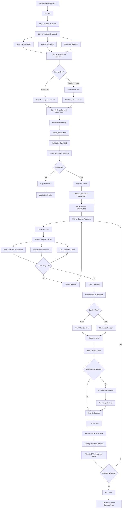
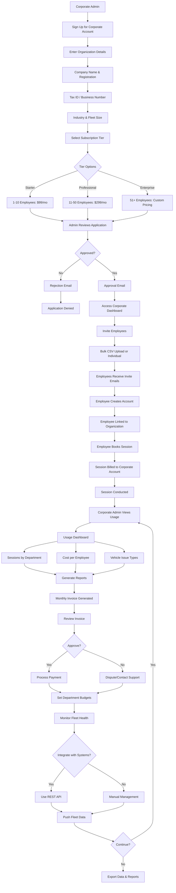
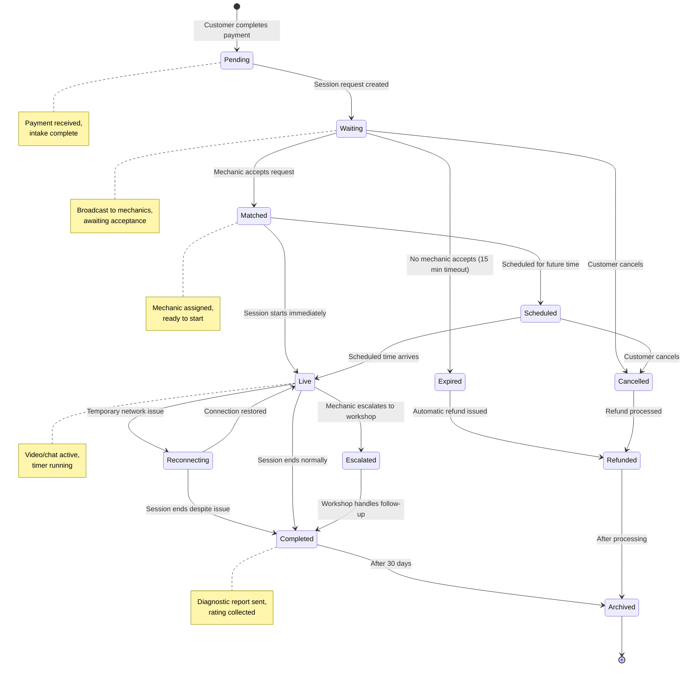
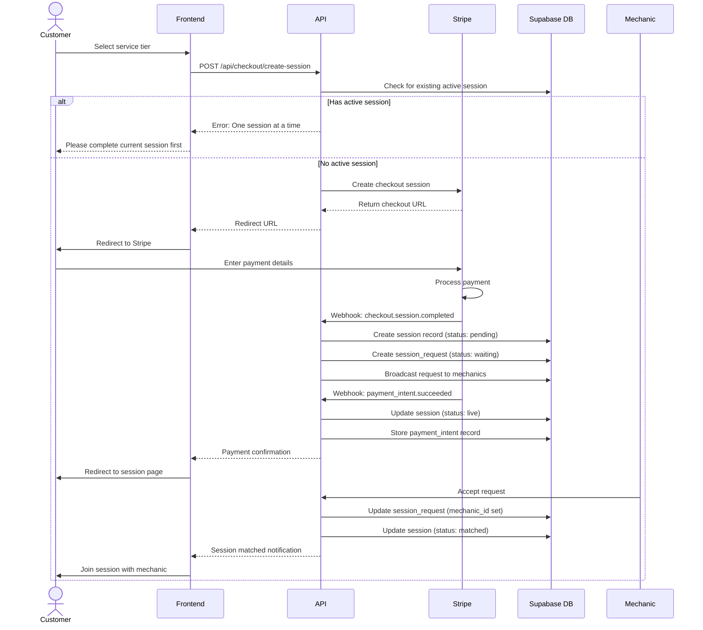
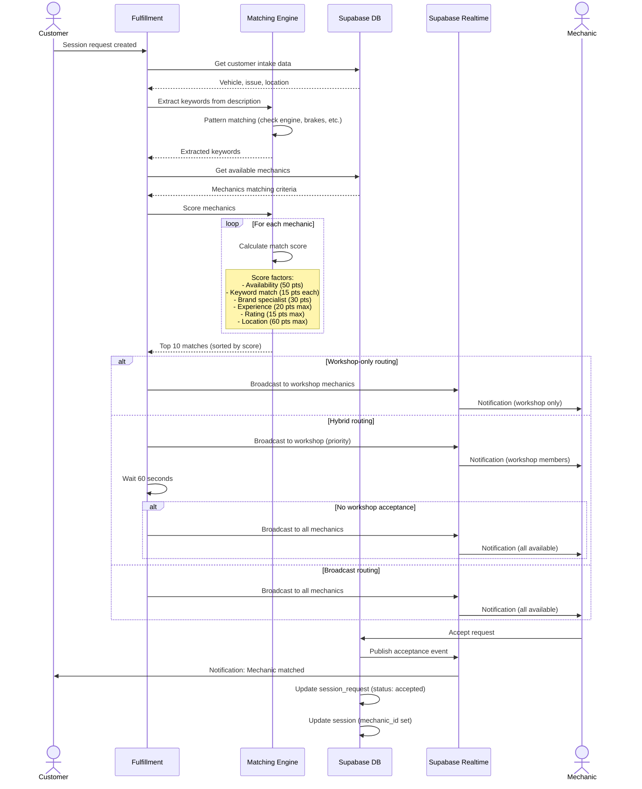
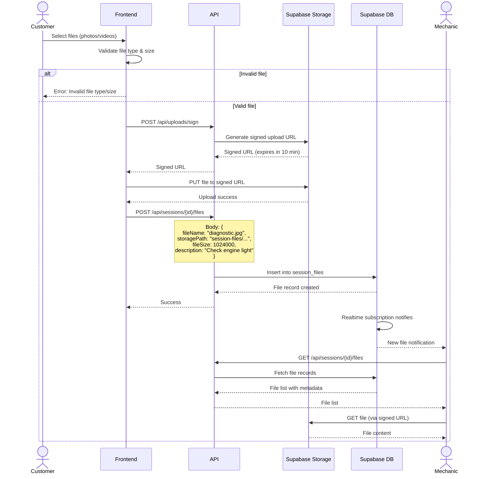
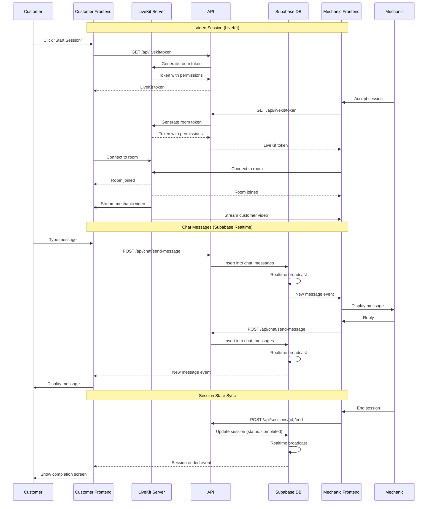
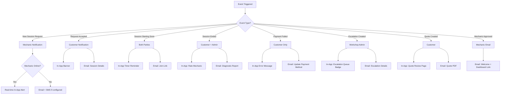

# AskAutoDoctor - Complete Business Model & Workflow Documentation

**Platform:** Virtual Automotive Diagnostic Service
**Tech Stack:** Next.js 14, TypeScript, Supabase, Stripe, LiveKit
**Last Updated:** October 2025
**Status:** Production-Ready

---

## Table of Contents

1. [Business Model Overview](#1-business-model-overview)
2. [User Roles & Personas](#2-user-roles--personas)
3. [Complete Workflow Diagrams](#3-complete-workflow-diagrams)
4. [Critical Data Flows](#4-critical-data-flows)
5. [Feature Inventory](#5-feature-inventory)
6. [Page & API Inventory](#6-page--api-inventory)

---

## 1. BUSINESS MODEL OVERVIEW

### Platform Description

**AskAutoDoctor** is a multi-sided marketplace connecting vehicle owners with certified automotive mechanics through live video/chat consultations. The platform enables instant automotive diagnostics, troubleshooting, and advice without requiring physical shop visits.

### Value Proposition

**For Customers:**
- Instant access to certified mechanics (no appointment needed)
- 50-80% cheaper than traditional in-person diagnostics
- Convenience - diagnose from anywhere (driveway, parking lot, home)
- Get second opinions before committing to expensive repairs
- Free trial session to test the platform
- Session recordings and written diagnostic reports

**For Mechanics:**
- Flexible work schedule (work from anywhere)
- Higher hourly rates than traditional shop employment
- No overhead costs (tools, workspace)
- Build personal client base through CRM
- Access to brand specialist partnership programs
- Multiple revenue streams (virtual + physical via workshops)

**For Workshops:**
- New revenue stream with zero overhead
- Manage distributed mechanic teams
- Virtual-to-physical conversion pipeline
- Generate leads for in-person repairs
- Automated revenue splits and payouts
- Performance analytics for mechanic teams

### Revenue Model

#### Pricing Tiers

| Plan | Price | Duration | Type | Target Use Case |
|------|-------|----------|------|-----------------|
| **Free Session** | $0 | 5 minutes | Text chat only | Trial, quick yes/no questions |
| **Quick Advice** | $4.99 | 2-10 minutes | Text chat + 1 photo | Micro-consultations, simple advice |
| **Quick Chat** | $9.99 | 30 minutes | Text chat + media | Warning lights, quick diagnostics |
| **Standard Video** | $29.99 | 45 minutes | HD video + chat | Complex issues, visual inspection |
| **Full Diagnostic** | $49.99 | 60 minutes | Video + report | Comprehensive diagnosis, pre-purchase inspection |

#### Commission Structure

**B2C (Direct to Customer) - Independent Mechanics:**
```
Customer Payment: $49.99 (Full Diagnostic)
├─ Platform Fee: ~$10 (20%)
└─ Mechanic Payout: ~$40 (80%)
```

**B2B2C (Workshop Partnerships):**
```
Customer Payment: $49.99
├─ Platform Fee: $9.99 (20% of total)
├─ Remaining: $40.00
   ├─ Workshop Commission: $4.00 (10% of remaining)
   └─ Mechanic Payout: $36.00 (90% of remaining)
```

**Configurable Revenue Splits:**
- Platform fee: 15-25% (negotiable for enterprise workshops)
- Workshop commission: 5-15% (configurable per workshop)
- Mechanic payout: 75-90% (varies by arrangement)

### Market Positioning

**Primary Target Markets:**
1. **Urban Car Owners** (25-45 years, tech-savvy)
2. **First-time Car Buyers** (need guidance and reassurance)
3. **DIY Enthusiasts** (want expert validation before repairs)
4. **Budget-Conscious Drivers** (avoid unnecessary shop visits)

**Geographic Focus:**
- Phase 1: Canada (Toronto, Vancouver, Montreal)
- Phase 2: United States (major metropolitan areas)
- Phase 3: International English-speaking markets

**Competitive Positioning:**
- **vs Traditional Shops:** 50-80% cheaper, instant access, no travel required
- **vs Phone Support:** Live video for visual inspection, not just verbal advice
- **vs DIY Forums:** Professional certified mechanics, not crowdsourced opinions
- **vs Mobile Mechanics:** Faster turnaround, lower cost, convenience

### Key Differentiators

1. **Multi-Sided Business Model:** B2C + B2B2C + B2B SaaS revenue streams
2. **Free Trial:** 5-minute free session removes friction
3. **Live Video + Chat:** Real-time visual diagnostics
4. **Workshop Network:** Path to in-person repairs via escalation system
5. **Smart Routing:** Intelligent mechanic matching based on expertise and location
6. **One-Session-at-a-Time Policy:** Prevents customer confusion and ensures focus
7. **Session Recordings:** Customers can review consultations anytime
8. **Brand Specialists:** Mechanics certified for specific brands (BMW, Tesla, etc.)

---

## 2. USER ROLES & PERSONAS

### Role 1: Customer

**Description:** Vehicle owners seeking automotive advice, diagnostics, or troubleshooting help.

**Goals:**
- Quickly understand what's wrong with their vehicle
- Get expert advice without visiting a shop
- Save money on unnecessary diagnostics
- Get second opinions before expensive repairs
- Learn basic troubleshooting skills

**Key Actions:**
- Sign up with email/OAuth (Google, Facebook, Apple)
- Select service tier and fill intake form
- Upload photos/videos of vehicle issue
- Choose time slot and accept waiver
- Complete Stripe payment
- Join video/chat session with mechanic
- Review diagnostic report and recordings
- Rate and review mechanic

**Pain Points Solved:**
- No need to schedule appointments days in advance
- Avoid towing fees or driving unsafe vehicles
- Get honest opinions (no upselling pressure)
- Access expertise for rare or complex issues
- Save time and money on diagnostics

**Success Metrics:**
- Session completion rate
- Customer satisfaction (NPS score)
- Repeat session rate
- Average session rating
- Time to session start (from booking)

---

### Role 2: Mechanic

**Description:** Certified automotive technicians offering virtual diagnostic services.

**Goals:**
- Earn flexible income on their schedule
- Build reputation and client base
- Work from anywhere (home, shop, mobile)
- Leverage expertise for higher hourly rates
- Access brand specialist programs for premium pay

**Key Actions:**
- Sign up and complete multi-step onboarding
- Upload credentials (Red Seal certification, insurance)
- Complete Stripe Connect onboarding
- Set availability and service tier (virtual-only or both)
- Accept/decline session requests in real-time
- Conduct video/chat consultations
- Take session notes and create diagnostic reports
- Escalate to workshop for in-person follow-up
- Track earnings and manage client relationships

**Pain Points Solved:**
- No shop overhead or tool investment
- Flexible hours (work when available)
- Access to customers beyond local area
- Higher pay than traditional hourly shop work
- Build personal brand and client base

**Success Metrics:**
- Sessions completed per week
- Average customer rating
- Earnings per session
- Response time to requests
- Session acceptance rate
- Client retention rate

---

### Role 3: Workshop Admin

**Description:** Auto repair shop owners/managers who want to offer virtual diagnostics and manage mechanic teams.

**Goals:**
- Generate new revenue stream (virtual diagnostics)
- Manage distributed mechanic workforce
- Convert virtual sessions to in-person repairs
- Track team performance and earnings
- Build reputation and customer base

**Key Actions:**
- Sign up with business details (registration, tax ID)
- Complete business verification
- Invite mechanics via email with unique codes
- Configure revenue split settings
- Review escalated sessions (virtual → in-person)
- Create repair quotes for customers
- Track workshop and mechanic earnings
- Manage service area coverage (postal codes)
- Monitor team performance analytics

**Pain Points Solved:**
- Expand services without physical expansion
- Tap into virtual diagnostic market
- Manage mobile/remote mechanics efficiently
- Generate leads for in-person repair work
- Automated payouts and revenue tracking

**Success Metrics:**
- Virtual sessions completed
- Conversion rate (virtual → in-person)
- Workshop revenue (commission + repairs)
- Mechanic retention rate
- Average repair quote value
- Team utilization rate

---

### Role 4: Corporate Admin

**Description:** Fleet managers or HR managers at companies with vehicle fleets or employee car benefits.

**Goals:**
- Manage employee access to automotive services
- Track company usage and spending
- Reduce vehicle downtime
- Provide employee benefits cost-effectively
- Generate reports for accounting/budgeting

**Key Actions:**
- Sign up organization account
- Invite employees via email
- Set department budgets and limits
- Track employee session usage
- Review aggregated diagnostic data
- Generate invoices and reports
- Manage fleet maintenance insights
- Configure integrations (REST API)

**Pain Points Solved:**
- Centralized fleet maintenance visibility
- Reduce vehicle repair costs
- Employee convenience (no shop visits)
- Faster issue resolution
- Simplified billing and accounting

**Success Metrics:**
- Employee adoption rate
- Average cost per vehicle issue
- Fleet uptime improvement
- Employee satisfaction with benefit
- Cost savings vs traditional shop visits

---

### Role 5: Platform Admin

**Description:** AskAutoDoctor staff managing platform operations, approvals, and support.

**Goals:**
- Ensure platform quality and compliance
- Review and approve mechanic/workshop applications
- Monitor session quality and disputes
- Manage platform settings and fees
- Track business metrics and growth

**Key Actions:**
- Review mechanic applications and credentials
- Approve/reject workshop applications
- Manage unattended session requests
- Handle customer support escalations
- Configure service plans and pricing
- Set platform fee rules
- Monitor real-time session activity
- Run analytics and generate reports
- Manage corporate accounts and invoicing
- Handle refunds and disputes

**Pain Points Solved:**
- Platform quality control
- Fraud prevention
- Compliance monitoring
- Business intelligence
- Operational efficiency

**Success Metrics:**
- Mechanic approval rate
- Average approval turnaround time
- Customer support response time
- Platform uptime
- Fraud detection rate
- Revenue per user segment

---

## 3. COMPLETE WORKFLOW DIAGRAMS

### Customer Journey

```mermaid
graph TD
    A[Customer Visits Homepage] --> B{Has Account?}
    B -->|No| C[Sign Up: Email/OAuth]
    B -->|Yes| D[Login]
    C --> E[Email Verification]
    E --> F[Select Service Tier]
    D --> F

    F --> G[Fill Intake Form]
    G --> H[Vehicle Details: Year/Make/Model/VIN]
    H --> I[Issue Description + Keywords]
    I --> J[Upload Photos/Videos]
    J --> K[Choose Time Slot]

    K --> L[Review & Accept Waiver]
    L --> M{Free Session Override?}
    M -->|Yes| N[Skip Payment]
    M -->|No| O[Stripe Checkout]

    O --> P[Payment Success]
    N --> Q[Session Request Created]
    P --> Q

    Q --> R[Smart Mechanic Matching]
    R --> S{Workshop Preferred?}
    S -->|Yes| T[Notify Workshop Mechanics]
    S -->|No| U[Broadcast to All Mechanics]

    T --> V[Mechanic Accepts Request]
    U --> V
    V --> W[Session Status: Accepted]

    W --> X{Session Type?}
    X -->|Chat| Y[Enter Chat Room]
    X -->|Video| Z[Join Video Session]

    Y --> AA[Live Chat Consultation]
    Z --> AB[Live Video Consultation]

    AA --> AC[Mechanic Provides Diagnosis]
    AB --> AC
    AC --> AD[Session Ends]

    AD --> AE[Receive Diagnostic Report]
    AE --> AF{Need In-Person Repair?}
    AF -->|Yes| AG[Escalate to Workshop]
    AF -->|No| AH[Rate & Review]

    AG --> AI[Workshop Creates Quote]
    AI --> AJ[Customer Reviews Quote]
    AJ --> AK{Accept Quote?}
    AK -->|Yes| AL[Schedule In-Person Repair]
    AK -->|No| AH

    AL --> AH
    AH --> AM[Session Complete]
    AM --> AN[Access Recording & Report]
```



---

### Mechanic Journey



---

### Workshop Journey

```mermaid
graph TD
    A[Workshop Owner Visits Platform] --> B[Sign Up for Workshop Account]
    B --> C[Step 1: Business Details]
    C --> D[Business Name & Registration]
    D --> E[Tax ID / GST Number]
    E --> F[Physical Address]

    F --> G[Step 2: Service Coverage]
    G --> H[Define Service Area: Postal Codes]
    H --> I[Set Mechanic Capacity]

    I --> J[Step 3: Stripe Connect Setup]
    J --> K[Business Bank Account]
    K --> L[Beneficial Owner Verification]

    L --> M[Application Submitted]
    M --> N[Admin Reviews Application]
    N --> O{Approved?}

    O -->|No| P[Rejection Email]
    O -->|Yes| Q[Approval Email]

    P --> END1[Application Denied]
    Q --> R[Access Workshop Dashboard]

    R --> S[Invite Mechanics]
    S --> T[Generate Unique Invite Code]
    T --> U[Send Invite Email]

    U --> V[Mechanic Receives Invite]
    V --> W[Mechanic Completes Signup with Code]
    W --> X[Workshop Sees Pending Approval]
    X --> Y[Review Mechanic Credentials]
    Y --> Z{Approve Mechanic?}

    Z -->|No| AA[Reject Mechanic]
    Z -->|Yes| AB[Activate Mechanic]

    AA --> S
    AB --> AC[Mechanic Added to Team]

    AC --> AD[Configure Revenue Split]
    AD --> AE[Platform: 20%, Workshop: 10%, Mechanic: 70%]

    AE --> AF[Wait for Sessions]
    AF --> AG{Session Routing?}

    AG -->|Workshop-Only| AH[Only Workshop Mechanics Notified]
    AG -->|Hybrid| AI[Prefer Workshop, Allow Others]
    AG -->|Broadcast| AJ[All Mechanics Notified]

    AH --> AK[Workshop Mechanic Accepts]
    AI --> AK
    AJ --> AK

    AK --> AL[Session Conducted]
    AL --> AM{Escalated?}

    AM -->|Yes| AN[Escalation Queue]
    AM -->|No| AO[Session Complete]

    AN --> AP[Review Escalation Details]
    AP --> AQ[Create Repair Quote]
    AQ --> AR[Parts: Name, Price, Quantity]
    AR --> AS[Labor: Hours, Rate]
    AS --> AT[Total Quote Calculated]

    AT --> AU[Send Quote to Customer]
    AU --> AV{Customer Accepts?}

    AV -->|No| AO
    AV -->|Yes| AW[Schedule In-Person Repair]

    AW --> AX[Complete Physical Repair]
    AX --> AY[Mark Quote as Completed]

    AY --> AO
    AO --> AZ[Revenue Split Calculated]
    AZ --> BA[Platform Fee Deducted]
    BA --> BB[Workshop Commission Earned]
    BB --> BC[Mechanic Payout Processed]

    BC --> BD[View Analytics Dashboard]
    BD --> BE{Continue?}
    BE -->|Yes| AF
    BE -->|No| END2[Review Performance Reports]
```



---

### Corporate Journey



---

### Session Lifecycle (State Machine)



---

## 4. CRITICAL DATA FLOWS

### Payment Processing Flow



**Key Points:**
- **Idempotency:** Webhook events stored in `stripe_events` table to prevent duplicate processing
- **One-Session Policy:** Enforced in fulfillment layer via `checkCustomerSessionStatus()`
- **Two-Phase Payment:**
  1. `checkout.session.completed` creates session and request
  2. `payment_intent.succeeded` activates session (status → live)
- **Refund Handling:** Automatic session status update to 'refunded' via database trigger
- **Dispute Handling:** Sessions flagged for admin review on chargeback

---

### Session Matching Flow



**Matching Algorithm Scoring:**

| Factor | Points | Notes |
|--------|--------|-------|
| **Online availability** | 50 | Highest priority |
| **Keyword match** | 15 each | Based on customer issue description |
| **Brand specialist** | 30 | Only if customer requests specific brand |
| **Experience (10+ years)** | 20 | Years in industry |
| **Experience (5+ years)** | 10 | |
| **Rating (4.5+)** | 15 | Customer rating average |
| **Rating (4.0+)** | 10 | |
| **Red Seal certified** | 10 | Official certification |
| **Profile completion (95%+)** | 8 | More reliable mechanics |
| **Completed sessions (50+)** | 12 | Platform experience |
| **Completed sessions (20+)** | 8 | |
| **Same country** | 25 | Location preference |
| **Same city** | 35 | Local match bonus |

---

### File Upload Flow



**File Storage Rules:**
- **Allowed types:** images (jpg, png, webp), videos (mp4, mov), documents (pdf)
- **Size limits:** Images (10 MB), Videos (100 MB), Documents (25 MB)
- **Storage path:** `session-files/{session_id}/{file_id}.ext`
- **Access control:** RLS policies ensure only session participants can access
- **Retention:** Files retained for 90 days post-session, then archived
- **Signed URLs:** Generated on-demand with 1-hour expiration

---

### Real-time Communication Flow



**Real-time Features:**
- **Video/Audio:** LiveKit WebRTC (peer-to-peer, low latency)
- **Chat Messages:** Supabase Realtime (WebSocket subscriptions)
- **Session State:** Supabase Realtime (status updates, timer sync)
- **File Uploads:** Real-time notification when files added
- **Mechanic Presence:** Online/offline status via Supabase Realtime
- **Request Queue:** Real-time updates when new requests arrive

---

### Notification Flow



**Notification Channels:**

| Event | In-App | Email | SMS | Push |
|-------|--------|-------|-----|------|
| New session request | ✅ | ✅ | ❌ | Future |
| Request accepted | ✅ | ✅ | ❌ | Future |
| Session starting (5 min) | ✅ | ✅ | ❌ | Future |
| Session ended | ✅ | ✅ | ❌ | ❌ |
| Payment failed | ✅ | ✅ | ❌ | ❌ |
| Mechanic approved | ❌ | ✅ | ❌ | ❌ |
| Workshop escalation | ✅ | ✅ | ❌ | ❌ |
| Quote created | ✅ | ✅ | ❌ | ❌ |
| Refund processed | ❌ | ✅ | ❌ | ❌ |

---

## 5. FEATURE INVENTORY

### Customer Features

#### Account Management
- ✅ Email/password authentication
- ✅ OAuth login (Google, Facebook, Apple)
- ✅ Email verification required
- ✅ Password reset flow
- ✅ Profile management (name, photo, phone)
- ✅ Payment methods (Stripe saved cards)
- ✅ Session history
- ✅ Saved vehicles

#### Booking & Sessions
- ✅ Service tier selection (5 plans)
- ✅ Intake form with vehicle details
- ✅ VIN decoder for auto-fill
- ✅ Photo/video upload (up to 5 files)
- ✅ Available mechanic preview
- ✅ Time slot selection
- ✅ Workshop preference (optional)
- ✅ Waiver acceptance (18+ verification)
- ✅ Free session override (admin-granted)
- ✅ One-session-at-a-time enforcement

#### Payment & Pricing
- ✅ Stripe checkout integration
- ✅ Free trial (5-minute session)
- ✅ Secure payment processing
- ✅ Payment history
- ✅ Automatic refunds (unattended sessions)
- ✅ Session extension payments

#### Session Experience
- ✅ Live video consultation (LiveKit ready)
- ✅ Text chat with file sharing
- ✅ Real-time messaging
- ✅ Session timer display
- ✅ Request extension (paid)
- ✅ End session control
- ✅ Post-session diagnostic report
- ✅ Session recording access (future)

#### Dashboard & History
- ✅ Active sessions view
- ✅ Upcoming appointments
- ✅ Session history with filters
- ✅ Favorite mechanics
- ✅ Repair quotes received
- ✅ Diagnostic reports archive

---

### Mechanic Features

#### Onboarding & Verification
- ✅ Multi-step signup wizard
- ✅ Personal details & bio
- ✅ Credentials upload (Red Seal, licenses)
- ✅ Liability insurance verification
- ✅ Background check consent
- ✅ Stripe Connect onboarding
- ✅ Service tier selection (virtual-only or both)
- ✅ Workshop assignment (via invite code)
- ✅ Admin approval workflow

#### Dashboard & Availability
- ✅ Real-time session request queue
- ✅ Active sessions manager
- ✅ Online/offline toggle
- ✅ Availability calendar
- ✅ Time-off requests
- ✅ Performance analytics
- ✅ Earnings summary
- ✅ CRM: Client list

#### Session Management
- ✅ Accept/decline requests
- ✅ View customer vehicle history
- ✅ Start/end sessions
- ✅ Session timer tracking
- ✅ Take session notes
- ✅ Upload diagnostic photos
- ✅ Create diagnostic report
- ✅ Escalate to workshop

#### Communication Tools
- ✅ In-session video (LiveKit ready)
- ✅ Text chat with customers
- ✅ File sharing (photos, videos, OBD codes)
- ✅ Real-time notifications

#### Business Tools
- ✅ Earnings dashboard (daily, weekly, monthly)
- ✅ Payment history & statements
- ✅ Client relationship management (CRM)
- ✅ Document storage (credentials, certs)
- ✅ Reviews & ratings display
- ✅ Brand specialist program applications
- ✅ Partnership program browsing

---

### Workshop Features

#### Onboarding & Setup
- ✅ Multi-step business signup
- ✅ Business verification (registration, tax ID)
- ✅ Service area setup (postal codes)
- ✅ Mechanic capacity planning
- ✅ Stripe Connect business account
- ✅ Admin approval workflow

#### Dashboard & Overview
- ✅ Organization summary
- ✅ Active mechanics list
- ✅ Pending invitations tracker
- ✅ Session statistics (daily, weekly, monthly)
- ✅ Revenue tracking dashboard

#### Mechanic Management
- ✅ Email invitation system
- ✅ Unique invite code generation
- ✅ Track invitation status
- ✅ Approve/reject mechanics
- ✅ View mechanic performance
- ✅ Assign service areas
- ✅ Deactivate mechanics

#### Escalation System
- ✅ Receive escalated sessions
- ✅ Virtual-to-physical conversion
- ✅ Customer handoff workflow
- ✅ Escalation queue management
- ✅ Session diagnostics review

#### Quote System
- ✅ Create repair quotes
- ✅ Parts breakdown (name, price, quantity)
- ✅ Labor breakdown (hours, rate)
- ✅ Total calculation with tax
- ✅ Send quote to customer
- ✅ Customer approval workflow
- ✅ Quote tracking (pending, accepted, declined)

#### Revenue & Analytics
- ✅ Workshop earnings dashboard
- ✅ Commission tracking (platform + workshop)
- ✅ Mechanic payout management
- ✅ Performance analytics
- ✅ Revenue split visualization
- ✅ Daily/weekly/monthly reports

#### Settings & Configuration
- ✅ Revenue split configuration
- ✅ Coverage area management
- ✅ Business details update
- ✅ Stripe Connect management
- ✅ Workshop profile (logo, description)

---

### Admin Features

#### Dashboard & Monitoring
- ✅ Platform-wide statistics
- ✅ Real-time session monitoring
- ✅ Quick actions panel
- ✅ System health overview
- ✅ Active users count
- ✅ Revenue summary

#### Core Operations
- ✅ Manage unattended requests
- ✅ Session request queue
- ✅ Mechanic applications review
- ✅ Workshop applications review
- ✅ Customer support tools
- ✅ Force end/cancel sessions
- ✅ Reassign sessions

#### User Management
- ✅ Customer accounts list
- ✅ Mechanic profiles management
- ✅ Workshop organizations management
- ✅ Role assignments
- ✅ Account suspension/activation
- ✅ Ban/unban users
- ✅ Free session override grants
- ✅ Email verification override

#### Content Management
- ✅ Partnership programs (CRUD)
- ✅ Service plans configuration
- ✅ Platform fees rules
- ✅ Revenue split rules
- ✅ Feature flags (future)

#### Analytics & Reporting
- ✅ Platform performance metrics
- ✅ Revenue reports (by segment)
- ✅ User growth charts
- ✅ Session analytics (completion rate, avg duration)
- ✅ Conversion tracking
- ✅ Export data (CSV, JSON)

#### System Settings & Tools
- ✅ Platform configuration
- ✅ Database query tool
- ✅ Admin logs viewer
- ✅ Error monitoring
- ✅ Cleanup utilities
- ✅ Test user creation
- ✅ Debug endpoints

---

### Corporate Features

#### Account Management
- ✅ Organization signup
- ✅ Subscription tier selection
- ✅ Admin approval workflow
- ✅ Billing information

#### Employee Management
- ✅ Invite employees (bulk or individual)
- ✅ Employee status tracking
- ✅ Department assignments
- ✅ Usage limits per employee
- ✅ Deactivate employees

#### Usage Tracking
- ✅ Session usage by department
- ✅ Cost per employee
- ✅ Vehicle issue type breakdown
- ✅ Diagnostic reports access

#### Billing & Reporting
- ✅ Monthly invoices
- ✅ Usage reports
- ✅ Export data (CSV)
- ✅ Budget alerts (future)

#### Integrations
- 🔄 REST API access (in progress)
- 🔄 Webhook notifications (future)
- 🔄 SSO integration (future)

---

## 6. PAGE & API INVENTORY

### Customer Pages

| Route | Purpose | Auth Required |
|-------|---------|---------------|
| `/` | Homepage with hero section | ❌ |
| `/signup` | Customer signup/login | ❌ |
| `/customer/verify-email` | Email verification prompt | ✅ |
| `/onboarding/pricing` | Service tier selection | ✅ |
| `/intake` | Intake form for session | ✅ |
| `/waiver` | Legal waiver acceptance | ✅ |
| `/customer/dashboard` | Customer dashboard | ✅ |
| `/customer/profile` | Profile settings | ✅ |
| `/customer/schedule` | Schedule new session | ✅ |
| `/customer/sessions` | Session history | ✅ |
| `/customer/quotes` | Repair quotes received | ✅ |
| `/customer/quotes/[quoteId]` | Quote details | ✅ |
| `/chat/[id]` | Live chat session | ✅ |
| `/video/[id]` | Live video session | ✅ |
| `/diagnostic/[id]` | Full diagnostic session | ✅ |
| `/checkout/success` | Payment success page | ✅ |
| `/thank-you` | Post-session thank you | ✅ |

---

### Mechanic Pages

| Route | Purpose | Auth Required |
|-------|---------|---------------|
| `/mechanic/login` | Mechanic login | ❌ |
| `/mechanic/signup` | Mechanic signup | ❌ |
| `/mechanic/onboarding/service-tier` | Select service type | ✅ |
| `/mechanic/onboarding/virtual-only` | Virtual-only confirmation | ✅ |
| `/mechanic/onboarding/stripe` | Stripe Connect setup | ✅ |
| `/mechanic/onboarding/stripe/complete` | Stripe setup complete | ✅ |
| `/mechanic/dashboard` | Mechanic dashboard | ✅ |
| `/mechanic/dashboard/virtual` | Virtual sessions only | ✅ |
| `/mechanic/profile` | Profile settings | ✅ |
| `/mechanic/availability` | Set availability calendar | ✅ |
| `/mechanic/sessions` | Session history | ✅ |
| `/mechanic/sessions/virtual` | Virtual session queue | ✅ |
| `/mechanic/session/[id]/complete` | Complete session form | ✅ |
| `/mechanic/earnings` | Earnings dashboard | ✅ |
| `/mechanic/statements` | Payment statements | ✅ |
| `/mechanic/analytics` | Business analytics | ✅ |
| `/mechanic/crm` | Client relationship mgmt | ✅ |
| `/mechanic/documents` | Document storage | ✅ |
| `/mechanic/reviews` | Customer reviews | ✅ |
| `/mechanic/job-recording` | Job recording (future) | ✅ |
| `/mechanic/partnerships/browse` | Browse programs | ✅ |
| `/mechanic/partnerships/applications` | My applications | ✅ |
| `/mechanic/partnerships/apply/[programId]` | Apply to program | ✅ |

---

### Workshop Pages

| Route | Purpose | Auth Required |
|-------|---------|---------------|
| `/workshop/login` | Workshop login | ❌ |
| `/workshop/signup` | Workshop signup | ❌ |
| `/workshop/signup/success` | Signup success | ❌ |
| `/workshop/dashboard` | Workshop dashboard | ✅ |
| `/workshop/analytics` | Workshop analytics | ✅ |
| `/workshop/quotes` | Repair quotes | ✅ |
| `/workshop/diagnostics` | Escalation queue | ✅ |
| `/workshop/diagnostics/[sessionId]/complete` | Complete escalation | ✅ |
| `/workshop/settings/revenue` | Revenue split config | ✅ |
| `/workshop/partnerships/programs` | Partnership programs | ✅ |

---

### Admin Pages

| Route | Purpose | Auth Required |
|-------|---------|---------------|
| `/admin/login` | Admin login | ❌ |
| `/admin/dashboard` | Admin dashboard | ✅ Admin |
| `/admin/intakes` | Intake forms list | ✅ Admin |
| `/admin/intakes/[id]/details` | Intake details | ✅ Admin |
| `/admin/sessions` | Sessions management | ✅ Admin |
| `/admin/customers` | Customers list | ✅ Admin |
| `/admin/mechanics` | Mechanics list | ✅ Admin |
| `/admin/workshops` | Workshops list | ✅ Admin |
| `/admin/workshops/applications` | Workshop applications | ✅ Admin |
| `/admin/plans` | Service plans config | ✅ Admin |
| `/admin/analytics/overview` | Platform analytics | ✅ Admin |
| `/admin/database` | Database query tool | ✅ Admin |
| `/admin/feature-flags` | Feature flags (future) | ✅ Admin |
| `/admin/emergency` | Emergency controls | ✅ Admin |

---

### Public Pages

| Route | Purpose | Auth Required |
|-------|---------|---------------|
| `/about` | About us page | ❌ |
| `/services-pricing` | Pricing page | ❌ |
| `/how-it-works` | How it works | ❌ |
| `/contact` | Contact form | ❌ |
| `/privacy` | Privacy policy | ❌ |
| `/terms` | Terms of service | ❌ |

---

### Customer API Endpoints

#### Authentication
- `POST /api/auth/logout` - Logout user
- `POST /api/customer/signup` - Create customer account
- `GET /api/customer/profile` - Get customer profile
- `POST /api/customer/profile` - Update customer profile
- `POST /api/customer/clear-plan` - Clear selected plan

#### Sessions
- `GET /api/customer/sessions` - List customer sessions
- `GET /api/customer/sessions/[sessionId]` - Get session details
- `POST /api/customer/sessions/[sessionId]/cancel` - Cancel session
- `POST /api/customer/sessions/[sessionId]/reschedule` - Reschedule session
- `POST /api/customer/sessions/[sessionId]/rate` - Rate mechanic
- `GET /api/customer/active-sessions` - Get active sessions
- `POST /api/customer/force-cancel-session` - Force cancel (debug)

#### Dashboard
- `GET /api/customer/dashboard/stats` - Dashboard statistics

#### Quotes
- `GET /api/customer/quotes` - List received quotes
- `GET /api/quotes/[quoteId]` - Get quote details
- `POST /api/quotes/[quoteId]/respond` - Accept/decline quote

#### Vehicles & Favorites
- `GET /api/customer/vehicles` - List saved vehicles
- `POST /api/customer/vehicles` - Add vehicle
- `GET /api/customer/favorites` - List favorite mechanics
- `POST /api/customer/favorites` - Add favorite
- `DELETE /api/customer/favorites/[favoriteId]` - Remove favorite

#### Bookings
- `GET /api/customer/bookings` - List bookings
- `POST /api/customer/schedule` - Schedule session

---

### Mechanic API Endpoints

#### Authentication
- `POST /api/mechanic/login` - Login mechanic
- `POST /api/mechanic/signup` - Create mechanic account
- `POST /api/mechanic/signup/draft` - Save draft application
- `POST /api/mechanics/logout` - Logout mechanic
- `GET /api/mechanics/me` - Get current mechanic
- `POST /api/mechanics/refresh` - Refresh auth token

#### Session Management
- `GET /api/mechanics/requests` - Get session requests
- `GET /api/mechanics/requests/history` - Request history
- `POST /api/mechanics/requests/[id]/accept` - Accept request
- `POST /api/mechanics/requests/[id]/cancel` - Cancel request
- `GET /api/mechanics/sessions/virtual` - Get virtual sessions
- `GET /api/mechanic/sessions/[sessionId]` - Get session details
- `POST /api/mechanic/sessions/complete` - Complete session
- `POST /api/mechanic/sessions/history` - Session history
- `GET /api/mechanic/active-sessions` - Get active sessions

#### Availability & Schedule
- `GET /api/mechanic/availability` - Get availability blocks
- `POST /api/mechanic/availability` - Set availability
- `GET /api/mechanic/time-off` - Get time-off requests
- `POST /api/mechanic/time-off` - Request time off
- `DELETE /api/mechanic/time-off/[id]` - Cancel time off
- `POST /api/mechanic/clock` - Clock in/out

#### Business & Analytics
- `GET /api/mechanics/analytics` - Business analytics
- `GET /api/mechanics/earnings` - Earnings summary
- `GET /api/mechanics/statements` - Payment statements
- `GET /api/mechanic/earnings` - Earnings details
- `GET /api/mechanics/dashboard/stats` - Dashboard stats

#### CRM & Clients
- `GET /api/mechanics/clients` - Client list
- `GET /api/mechanics/clients/[clientId]` - Client details
- `POST /api/mechanics/clients` - Add client
- `PUT /api/mechanics/clients/[clientId]` - Update client

#### Partnerships
- `GET /api/mechanics/partnerships/programs` - List programs
- `GET /api/mechanics/partnerships/applications` - My applications
- `POST /api/mechanics/partnerships/applications` - Apply to program

#### Documents & Reviews
- `GET /api/mechanic/documents` - List documents
- `POST /api/mechanic/documents` - Upload document
- `DELETE /api/mechanic/documents/[id]` - Delete document
- `POST /api/mechanic/upload-document` - Upload credential
- `GET /api/mechanic/reviews` - Customer reviews

#### Workshop Integration
- `POST /api/mechanic/accept` - Accept session (legacy)
- `POST /api/mechanic/escalate-session` - Escalate to workshop
- `POST /api/mechanic/workshop-signup` - Sign up via workshop invite

#### Onboarding
- `POST /api/mechanics/onboarding/service-tier` - Select service tier
- `POST /api/mechanics/onboarding/virtual-only` - Confirm virtual-only

#### Stripe
- `POST /api/mechanics/stripe/onboard` - Start Stripe onboarding

---

### Workshop API Endpoints

#### Authentication
- `POST /api/workshop/login` - Login workshop admin
- `POST /api/workshop/logout` - Logout workshop admin

#### Dashboard
- `GET /api/workshop/dashboard` - Workshop dashboard data
- `GET /api/workshop/diagnostics` - Diagnostics page data

#### Signup
- `POST /api/workshop/signup` - Create workshop account

#### Mechanics
- `POST /api/workshop/invite-mechanic` - Invite mechanic

#### Quotes
- `GET /api/workshop/quotes` - List quotes
- `POST /api/workshop/quotes/create` - Create quote

#### Diagnostics & Escalations
- `GET /api/workshop/diagnostics/[sessionId]` - Get escalation details
- `POST /api/workshop/diagnostics/[sessionId]/complete` - Complete escalation
- `GET /api/workshop/escalation-queue` - Escalation queue

#### Earnings
- `GET /api/workshop/earnings` - Workshop earnings

#### Stripe
- `POST /api/workshop/stripe/onboard` - Stripe onboarding

---

### Admin API Endpoints

#### Authentication
- `POST /api/admin/login` - Admin login
- `POST /api/admin/logout` - Admin logout
- `GET /api/admin/debug-auth` - Debug auth state
- `POST /api/admin/test-login` - Test login

#### Dashboard
- `GET /api/admin/dashboard/stats` - Dashboard statistics

#### Users
- `GET /api/admin/users/customers` - List customers
- `GET /api/admin/users/mechanics` - List mechanics
- `GET /api/admin/users/mechanics/[id]` - Mechanic details
- `POST /api/admin/users/mechanics/[id]/approve` - Approve mechanic
- `POST /api/admin/users/mechanics/[id]/adjust-rating` - Adjust rating
- `GET /api/admin/users/[id]` - User details
- `POST /api/admin/users/[id]/suspend` - Suspend user
- `POST /api/admin/users/[id]/ban` - Ban user
- `POST /api/admin/users/[id]/verify-email` - Verify email
- `POST /api/admin/users/[id]/reset-password` - Reset password
- `POST /api/admin/users/[id]/notify` - Send notification
- `POST /api/admin/users/[id]/notes` - Add user note
- `POST /api/admin/users/[id]/free-session-override` - Grant free session
- `GET /api/admin/users/export` - Export users

#### Sessions
- `GET /api/admin/sessions/stats` - Session statistics
- `POST /api/admin/sessions/reassign` - Reassign session
- `POST /api/admin/sessions/force-cancel` - Force cancel
- `POST /api/admin/sessions/force-end` - Force end
- `POST /api/admin/sessions/bulk-cancel` - Bulk cancel
- `POST /api/admin/sessions/join` - Join session as observer
- `GET /api/admin/sessions/[id]/timeline` - Session timeline
- `GET /api/admin/sessions/[id]/files` - Session files
- `GET /api/admin/sessions/[id]/chat` - Session chat history
- `GET /api/admin/sessions/export` - Export sessions

#### Requests
- `GET /api/admin/requests` - List session requests
- `POST /api/admin/requests/[id]/assign` - Assign request
- `POST /api/admin/clear-session-requests` - Clear requests

#### Intakes
- `GET /api/admin/intakes/query` - Query intakes
- `GET /api/admin/intakes/[id]` - Intake details
- `POST /api/admin/intakes/update-status` - Update status
- `GET /api/admin/intakes/export` - Export intakes

#### Mechanics
- `GET /api/admin/mechanics/applications` - Applications list
- `POST /api/admin/mechanics/[id]/approve` - Approve mechanic
- `POST /api/admin/mechanics/[id]/reject` - Reject mechanic
- `GET /api/admin/mechanics/[id]/request_info` - Request more info

#### Mechanic Documents
- `GET /api/admin/mechanic-documents` - List documents
- `POST /api/admin/mechanic-documents/[id]/review` - Review document

#### Workshops
- `GET /api/admin/workshops` - List workshops
- `GET /api/admin/workshops/applications` - Applications
- `POST /api/admin/workshops/[id]/approve` - Approve workshop
- `POST /api/admin/workshops/[id]/reject` - Reject workshop
- `POST /api/admin/workshops/[id]/suspend` - Suspend workshop
- `POST /api/admin/workshops/[id]/reactivate` - Reactivate workshop

#### Corporate
- `GET /api/admin/corporate` - List corporate accounts
- `POST /api/admin/corporate/[id]/approve` - Approve corporate
- `POST /api/admin/corporate/[id]/reject` - Reject corporate
- `POST /api/admin/corporate/[id]/suspend` - Suspend corporate
- `POST /api/admin/corporate/[id]/generate-invoice` - Generate invoice

#### Plans & Fees
- `GET /api/admin/plans` - List service plans
- `POST /api/admin/plans` - Create plan
- `PUT /api/admin/plans/[id]` - Update plan
- `POST /api/admin/plans/[id]/toggle` - Toggle active status
- `GET /api/admin/fees/rules` - List fee rules
- `POST /api/admin/fees/rules` - Create fee rule
- `PUT /api/admin/fees/rules/[ruleId]` - Update fee rule

#### Analytics
- `GET /api/admin/analytics/workshop-overview` - Workshop overview
- `GET /api/admin/analytics/workshop-health/[id]` - Workshop health
- `GET /api/admin/analytics/beta-program` - Beta program stats

#### System
- `GET /api/admin/logs` - System logs
- `GET /api/admin/logs/stats` - Log statistics
- `GET /api/admin/errors` - Error logs
- `GET /api/admin/errors/[id]` - Error details
- `POST /api/admin/database/query` - Run database query
- `GET /api/admin/database/history` - Query history
- `POST /api/admin/database/saved-queries` - Saved queries
- `GET /api/admin/health` - System health
- `GET /api/admin/cleanup/preview` - Preview cleanup
- `POST /api/admin/cleanup/execute` - Execute cleanup
- `GET /api/admin/cleanup/history` - Cleanup history
- `POST /api/admin/clear-all-sessions` - Clear all sessions (debug)

---

### Shared API Endpoints

#### Checkout & Payments
- `GET /api/checkout/create-session` - Create Stripe checkout
- `GET /api/checkout/resolve` - Resolve checkout session
- `POST /api/stripe/webhook` - Stripe webhook handler

#### Sessions
- `GET /api/sessions` - List sessions
- `GET /api/sessions/[id]` - Session details
- `POST /api/sessions/[id]/start` - Start session
- `POST /api/sessions/[id]/end` - End session
- `GET /api/sessions/[id]/status` - Session status
- `POST /api/sessions/[id]/upgrade` - Upgrade session tier
- `GET /api/sessions/[id]/files` - Session files
- `POST /api/sessions/[id]/files` - Upload session file
- `GET /api/sessions/[id]/summary` - Session summary
- `GET /api/sessions/[id]/upsells` - Get upsells
- `DELETE /api/sessions/[id]/delete` - Delete session
- `GET /api/sessions/resolve-by-stripe` - Resolve by Stripe ID

#### Session Extensions
- `POST /api/sessions/extend` - Extend session (legacy)
- `POST /api/session/extend` - Extend session
- `POST /api/sessions/upgrade/payment` - Process extension payment

#### Intake & Waiver
- `POST /api/intake/start` - Start intake
- `POST /api/waiver/submit` - Submit waiver
- `GET /api/waiver/get` - Get waiver details
- `GET /api/waiver/check` - Check waiver status

#### Chat
- `POST /api/chat/send-message` - Send chat message
- `GET /api/chat/session-info` - Get session info
- `GET /api/chat/debug-messages` - Debug messages

#### Service Plans
- `GET /api/plans` - Get service plans

#### Matching
- `POST /api/matching/find-mechanics` - Find matching mechanics

#### Utilities
- `GET /api/brands` - List car brands
- `GET /api/countries` - List countries
- `GET /api/cities` - List cities
- `GET /api/service-keywords` - Service keywords
- `POST /api/keywords/extract` - Extract keywords
- `POST /api/vin/decode` - Decode VIN
- `GET /api/health` - Health check
- `POST /api/contact` - Contact form

#### Uploads
- `POST /api/uploads/sign` - Get signed upload URL
- `POST /api/uploads/put` - Upload file

#### Mechanic Profile
- `GET /api/mechanics/[mechanicId]/profile` - Public profile
- `GET /api/mechanics/[mechanicId]/profile-completion` - Profile completion
- `GET /api/mechanics/available-count` - Available mechanics count

#### Workshop Directory
- `GET /api/workshops/directory` - Workshop directory
- `GET /api/workshops/programs` - Workshop programs
- `GET /api/workshops/applications` - Applications
- `POST /api/workshops/applications` - Submit application
- `GET /api/workshops/applications/[applicationId]` - Application details

#### Geo & Location
- `GET /api/geo/detect` - Detect location
- `GET /api/geo/countries` - List countries

#### Cron Jobs
- `GET /api/cron/monitor-sessions` - Monitor sessions
- `GET /api/cron/workshop-metrics` - Workshop metrics
- `GET /api/cron/workshop-alerts` - Workshop alerts

#### Debug Endpoints (Development Only)
- `GET /api/debug/check-session` - Check session state
- `GET /api/debug/check-request` - Check request state
- `GET /api/debug/auth-status` - Check auth status
- `GET /api/debug/pending-requests` - List pending requests
- `GET /api/debug/mechanic-requests` - Mechanic requests
- `GET /api/debug/session-health` - Session health
- `GET /api/debug/session-requests` - Session requests
- `GET /api/debug/vehicles` - Debug vehicles
- `GET /api/debug/check-active-sessions` - Active sessions
- `GET /api/debug/check-schema` - Check schema
- `POST /api/debug/create-missing-request` - Create request
- `POST /api/debug/fix-session` - Fix session
- `POST /api/debug/fix-orphaned-session` - Fix orphaned
- `POST /api/debug/cleanup-pending-sessions` - Cleanup pending
- `POST /api/debug/cleanup-live-sessions` - Cleanup live
- `POST /api/debug/cleanup-ghost-requests` - Cleanup ghost
- `POST /api/debug/cleanup-sessions` - General cleanup
- `POST /api/debug/cleanup-user-data` - Cleanup user data
- `POST /api/debug/clear-customer-sessions` - Clear customer
- `POST /api/debug/force-cancel-session` - Force cancel
- `POST /api/debug/reset-broken-requests` - Reset requests
- `POST /api/debug/clear-old-requests` - Clear old
- `POST /api/test-create-request` - Test create request

---

## Summary

This documentation provides a comprehensive overview of the AskAutoDoctor platform's business model, user workflows, and technical architecture. Key takeaways:

1. **Three Revenue Models:** B2C (direct to consumer), B2B2C (workshop partnerships), and B2B SaaS (corporate)
2. **Five User Roles:** Customer, Mechanic, Workshop Admin, Corporate Admin, Platform Admin
3. **Smart Matching:** Intelligent mechanic routing based on expertise, location, and availability
4. **One-Session Policy:** Enforced to prevent customer confusion and ensure focused service
5. **Comprehensive API:** 250+ endpoints covering all platform functionality
6. **Real-time Communication:** LiveKit for video, Supabase Realtime for chat and state sync
7. **Secure Payments:** Stripe standard + Connect for marketplace payouts
8. **Quality Control:** Multi-step verification for mechanics and workshops

**Platform Status:** Production-ready core functionality. Video integration and email notifications are the final items for full launch.

---

**Document Version:** 1.0
**Created:** October 2025
**Maintained By:** AskAutoDoctor Product Team
