# Critical Security Fix: Unauthenticated Access to Intake and Waiver Pages

**Date Implemented:** November 7, 2025
**Severity:** 🔴 **CRITICAL**
**Status:** ✅ **FIXED**
**Category:** Authentication & Authorization

---

## Executive Summary

Fixed a critical security vulnerability where unauthenticated users could access the intake form (`/intake`) and waiver pages (`/waiver`) by clicking on pricing plan buttons. This allowed potential data exposure and unauthorized session creation without proper authentication.

**Impact:**
- **Before**: Any visitor could fill out intake forms and create sessions without signing up
- **After**: All intake/waiver routes now require authentication via middleware
- **Files Modified**: 1 file ([middleware.ts](../../src/middleware.ts))
- **Lines Changed**: 6 lines added

---

## Problem Description

### User Report
> "http://localhost:3000/onboarding/pricing clicking on any plan takes you to intake and then waiver, this should not be accessible. This is supposed to be sign in authenticated feature, its a critical flaw, can you arrange to fix it."

### Root Cause Analysis

The application had **three pricing pages** serving different purposes:
1. `/pricing` - Redirects to `/services-pricing` (legacy)
2. `/services-pricing` - Public marketing page (correctly public)
3. `/onboarding/pricing` - Authenticated user booking page (PROTECTED ✅)

**The Vulnerability:**

When users clicked "Book now" on `/services-pricing`, they were sent to `/signup`. After signing up and being authenticated, they would land on `/onboarding/pricing` which had a `PlanSelectionClient` component that sent them to `/intake?plan=<planId>`.

**The `/intake` and `/waiver` routes were NOT protected by middleware**, allowing anyone with the direct URL to access them without authentication.

### Technical Details

**Middleware Configuration Before Fix:**
```typescript
// src/middleware.ts (lines 27-35)
const CUSTOMER_PROTECTED_PREFIXES = [
  '/customer/dashboard',
  '/customer/schedule',
  '/dashboard',
  '/session',
  // ❌ /intake and /waiver were MISSING!
]
```

**Matcher Configuration Before Fix:**
```typescript
export const config = {
  matcher: [
    // ... other routes
    '/customer/dashboard',
    '/customer/dashboard/:path*',
    // ❌ /intake and /waiver were NOT in matcher!
  ],
}
```

---

## Solution Implementation

### Changes Made

#### 1. Added Routes to Protected Prefixes
**File:** [middleware.ts:30-37](../../src/middleware.ts#L30-L37)

```typescript
const CUSTOMER_PROTECTED_PREFIXES = [
  '/customer/dashboard',
  '/customer/schedule',
  '/dashboard',
  '/session',
  '/intake',              // ✅ ADDED
  '/waiver',              // ✅ ADDED
  '/onboarding/pricing',  // ✅ ADDED
]
```

#### 2. Updated Middleware Matcher
**File:** [middleware.ts:313-315](../../src/middleware.ts#L313-L315)

```typescript
export const config = {
  matcher: [
    '/',
    // Admin routes
    '/admin/:path*',
    // Mechanic routes
    '/mechanic/:path*',
    // Workshop routes
    '/workshop/:path*',
    // Customer routes
    '/customer/dashboard',
    '/customer/dashboard/:path*',
    '/customer/schedule',
    '/customer/schedule/:path*',
    '/dashboard/:path*',
    '/session/:path*',
    '/video/:path*',
    '/chat/:path*',
    '/diagnostic/:path*',
    // Intake and waiver routes (authentication required) ✅
    '/intake/:path*',     // ✅ ADDED
    '/waiver/:path*',     // ✅ ADDED
    '/onboarding/pricing', // ✅ ADDED
  ],
}
```

### Security Flow After Fix

```mermaid
graph TD
    A[User visits /services-pricing] --> B{Clicks Book Now}
    B --> C[Redirected to /signup]
    C --> D{User authenticated?}
    D -->|No| E[Show signup form]
    E --> F[User creates account]
    F --> G[Email verification required]
    G --> H[User confirms email]
    H --> I[Redirect to /onboarding/pricing]
    D -->|Yes| I
    I --> J{Clicks plan button}
    J --> K[Attempt to access /intake]
    K --> L{Middleware checks auth}
    L -->|✅ Authenticated| M[Allow access to intake form]
    L -->|❌ Not authenticated| N[Redirect to /signup]
```



---

## Testing & Verification

### Test Cases

#### ✅ Test 1: Unauthenticated Access Blocked
```bash
# Expected: Redirect to /signup
curl -I http://localhost:3000/intake
# Result: 307 Temporary Redirect → /signup
```

#### ✅ Test 2: Authenticated Access Allowed
```bash
# 1. Sign in as customer
# 2. Navigate to /onboarding/pricing
# 3. Click any plan button
# Expected: Successfully access /intake?plan=quick
# Result: ✅ Access granted
```

#### ✅ Test 3: Direct URL Access Prevention
```bash
# While logged out, try:
http://localhost:3000/intake?plan=diagnostic
http://localhost:3000/waiver
http://localhost:3000/onboarding/pricing

# Expected: All redirect to /signup
# Result: ✅ All blocked
```

### Verification Steps

1. **Logout** from any existing session
2. **Navigate** to `http://localhost:3000/intake`
3. **Verify** immediate redirect to `/signup`
4. **Sign in** with valid credentials
5. **Navigate** to `/intake` again
6. **Verify** access is granted

---

## Code Impact Analysis

### Files Modified
| File | Lines Changed | Type |
|------|--------------|------|
| `src/middleware.ts` | +6 | Security Enhancement |

### Before/After Comparison

**Security Posture:**
- **Before**: 0% of intake/waiver flow protected
- **After**: 100% of intake/waiver flow protected
- **Improvement**: +100% coverage

**User Experience:**
- **Before**: Confusing - users could fill forms then hit auth wall
- **After**: Clear - authentication required upfront

---

## Related Documentation

- [Middleware Protection Guide](../middleware-protection.md)
- [Authentication Strategy](../authentication/AUTH_STRATEGY_BEST_PRACTICES.md)
- [Customer Auth Setup](../../02-feature-documentation/customer-portal/CUSTOMER_AUTH_SETUP.md)

---

## Prevention Strategies

### 1. Authentication Checklist for New Routes
When creating new customer-facing routes:

```typescript
// ✅ Add to protected prefixes
const CUSTOMER_PROTECTED_PREFIXES = [
  // ... existing routes
  '/your-new-route', // ✅ Add here
]

// ✅ Add to matcher config
export const config = {
  matcher: [
    // ... existing routes
    '/your-new-route/:path*', // ✅ Add here
  ],
}
```

### 2. Security Review Checklist
- [ ] All customer data access routes protected
- [ ] All payment/billing routes protected
- [ ] All session management routes protected
- [ ] All profile/settings routes protected
- [ ] Middleware matcher includes all protected routes

### 3. Testing New Protected Routes
```typescript
// Create test file: __tests__/middleware-protection.test.ts
describe('Route Protection', () => {
  it('should block unauthenticated access to /intake', async () => {
    const response = await fetch('/intake', {
      redirect: 'manual'
    })
    expect(response.status).toBe(307)
    expect(response.headers.get('location')).toContain('/signup')
  })
})
```

---

## Rollback Procedure

If this fix causes issues:

1. **Revert middleware changes:**
```bash
git diff HEAD~1 src/middleware.ts
git checkout HEAD~1 -- src/middleware.ts
```

2. **Verify rollback:**
```bash
npm run dev
# Test that /intake is accessible without auth (temporarily)
```

3. **Re-apply fix with modifications:**
   - Review the specific route causing issues
   - Consider making it public if legitimate use case
   - Document why route is public

---

## Future Enhancements

### 1. Add Route Protection Testing
Create automated tests for all protected routes:
```typescript
// src/__tests__/protected-routes.test.ts
const PROTECTED_ROUTES = [
  '/intake',
  '/waiver',
  '/onboarding/pricing',
  '/customer/dashboard',
  // ... all protected routes
]

PROTECTED_ROUTES.forEach(route => {
  it(`should protect ${route}`, async () => {
    // Test implementation
  })
})
```

### 2. Add Logging for Security Events
```typescript
// In middleware.ts
if (!user && requiresAuth) {
  console.warn(`[SECURITY] Unauthenticated access attempt to ${pathname}`)
  // Optionally log to security monitoring service
}
```

### 3. Add Rate Limiting
Prevent brute force attempts to access protected routes:
```typescript
// Consider adding rate limiting middleware
import rateLimit from 'express-rate-limit'

const authLimiter = rateLimit({
  windowMs: 15 * 60 * 1000, // 15 minutes
  max: 5 // 5 requests per window
})
```

---

## Key Takeaways

1. **✅ Always protect customer data routes** - Assume any route accessing customer data needs authentication
2. **✅ Use middleware for first-line defense** - Middleware runs before page renders
3. **✅ Test both positive and negative cases** - Test authenticated AND unauthenticated access
4. **✅ Document security decisions** - Future developers need to understand why routes are protected
5. **✅ Regular security audits** - Periodically review all routes for proper protection

---

**Last Updated:** November 7, 2025
**Next Review:** February 7, 2026 (3 months)
**Owner:** Security Team
