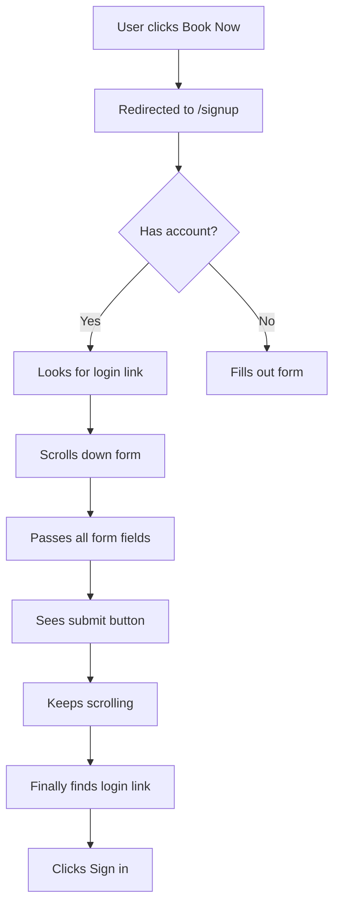
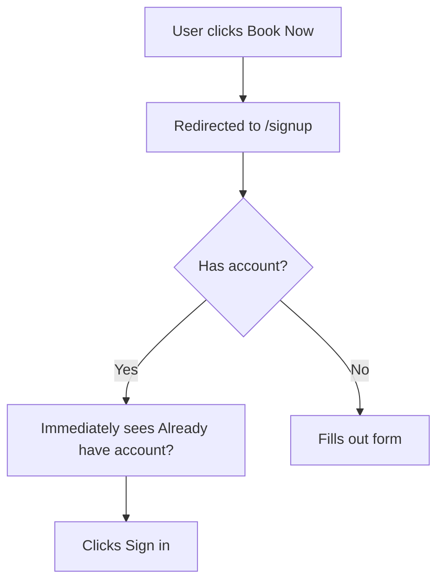

# Signup/Login Link Placement UX Improvement

**Date Implemented:** November 7, 2025
**Category:** User Experience (UX)
**Status:** ✅ **COMPLETE**
**Priority:** 🟢 **MEDIUM** (UX Enhancement)

---

## Executive Summary

Improved user experience by relocating the "Already have an account? Sign in" link from the bottom of a long signup form to a prominent position at the top, matching industry-standard UX patterns.

**Impact:**
- **Before**: Link buried at bottom after 10+ form fields
- **After**: Link visible immediately at top of form
- **User Benefit**: Returning users find login link instantly
- **Files Modified**: 1 file ([SignupGate.tsx](../../src/app/signup/SignupGate.tsx))

---

## Problem Description

### User Request
> "when users click on book now and they are redirected to http://localhost:3000/signup, if someone already has an account, where do you think is the best placement for already have an account, sign in"

### UX Analysis

**Current State Issues:**

1. **Poor Discoverability**: The "Already have an account? Sign in" link was located at the **very bottom** of the signup form (after all fields):
   - First name, Last name
   - Phone, Date of birth
   - Address
   - City, Country
   - Vehicle (optional)
   - Email, Password
   - Waiver acceptance section
   - Submit button
   - Mechanic availability button
   - Error/success messages
   - **THEN** the login link (line 681-692)

2. **High Cognitive Load**: Users had to:
   - Scroll through entire form
   - Read multiple field labels
   - Skip past CTA buttons
   - Then find the login link

3. **Frustration for Returning Users**:
   - Returning users who accidentally clicked "Book now" → "Sign up" had to search for the login option
   - Increased likelihood of form abandonment
   - Potentially created duplicate accounts

### Industry Standard Comparison

**Best Practice Patterns (observed on major platforms):**

| Platform | Login Link Placement |
|----------|---------------------|
| Google | Top of form, before any fields |
| Facebook | Top, directly under "Sign Up" header |
| Amazon | Top, with prominent "Already a customer? Sign in" |
| Stripe | Top right of form card |
| GitHub | Top center, immediately visible |
| **TheAutoDoctor (Before)** | ❌ Bottom, after all fields |
| **TheAutoDoctor (After)** | ✅ Top, under header |

---

## Solution Implementation

### Changes Made

**File:** [src/app/signup/SignupGate.tsx](../../src/app/signup/SignupGate.tsx)

#### 1. Added Link at Top (Lines 376-385)

**New Placement:**
```typescript
<div className="mb-8">
  <h2 className="text-2xl font-bold text-white">
    {mode === "login" ? "Welcome Back" : "Create Account"}
  </h2>
  <p className="mt-2 text-sm text-slate-400">
    {mode === "login"
      ? "Sign in to access your diagnostic sessions"
      : (
          <>
            Create your account to book a mechanic session.{" "}
            <span className="text-orange-400 font-semibold">
              Start with a FREE 5-minute trial!
            </span>
          </>
        )}
  </p>
  {/* ✅ NEW: Login link moved here */}
  <p className="mt-4 text-center text-sm text-slate-400">
    {mode === "login" ? "Don't have an account?" : "Already have an account?"}{" "}
    <button
      type="button"
      onClick={() => setMode(mode === "login" ? "signup" : "login")}
      className="font-semibold text-orange-400 transition hover:text-orange-300 hover:underline"
    >
      {mode === "login" ? "Create account" : "Sign in"}
    </button>
  </p>
</div>
```

#### 2. Removed Duplicate Link at Bottom

**Removed from lines 681-692:**
```typescript
// ❌ REMOVED
<div className="mt-6 text-center">
  <p className="text-sm text-slate-400">
    {mode === "login" ? "Don't have an account?" : "Already have an account?"}{" "}
    <button
      type="button"
      onClick={() => setMode(mode === "login" ? "signup" : "login")}
      className="font-semibold text-orange-400 transition hover:text-orange-300 hover:underline"
    >
      {mode === "login" ? "Create account" : "Sign in"}
    </button>
  </p>
</div>
```

---

## Visual Layout Comparison

### Before (Bottom Placement)

```
┌─────────────────────────────────────┐
│ Create Account                      │
│ Create your account to book...      │
├─────────────────────────────────────┤
│ [First Name] [Last Name]           │
│ [Phone] [DOB]                       │
│ [Address]                           │
│ [City] [Country]                    │
│ [Vehicle (optional)]                │
│ [Email]                             │
│ [Password]                          │
│ ┌─────────────────────────────────┐ │
│ │ Review & Accept Terms           │ │
│ └─────────────────────────────────┘ │
│ [Create Account Button]             │
│ [See mechanics online button]       │
│ [Error/Success Messages]            │
│                                      │
│ Already have an account? Sign in ← HERE (Must scroll to see)
└─────────────────────────────────────┘
```

### After (Top Placement)

```
┌─────────────────────────────────────┐
│ Create Account                      │
│ Create your account to book...      │
│ Already have an account? Sign in ← HERE (Immediately visible)
├─────────────────────────────────────┤
│ [First Name] [Last Name]           │
│ [Phone] [DOB]                       │
│ [Address]                           │
│ [City] [Country]                    │
│ [Vehicle (optional)]                │
│ [Email]                             │
│ [Password]                          │
│ ┌─────────────────────────────────┐ │
│ │ Review & Accept Terms           │ │
│ └─────────────────────────────────┘ │
│ [Create Account Button]             │
│ [See mechanics online button]       │
│ [Error/Success Messages]            │
└─────────────────────────────────────┘
```

---

## User Journey Improvement

### Before Fix


**Time to find login: 5-10 seconds** (with scrolling)

### After Fix


**Time to find login: <1 second** (no scrolling needed)

---

## Testing & Verification

### Manual Testing Checklist

#### ✅ Test 1: Visual Verification (Desktop)
1. Navigate to `http://localhost:3000/signup`
2. **Verify**: Login link appears directly under header
3. **Verify**: Link is centered and prominent
4. **Verify**: No duplicate link at bottom

#### ✅ Test 2: Visual Verification (Mobile)
1. Open dev tools → mobile view (375px width)
2. Navigate to `/signup`
3. **Verify**: Login link still visible without scrolling
4. **Verify**: Text doesn't wrap awkwardly

#### ✅ Test 3: Functional Testing
1. Navigate to `/signup`
2. Click "Sign in" link at top
3. **Verify**: Form switches to login mode
4. **Verify**: OAuth buttons appear (Google, Facebook, Apple)
5. **Verify**: "Don't have an account? Create account" now shows

#### ✅ Test 4: No Duplicate Links
1. Navigate to `/signup`
2. Scroll through entire page
3. **Verify**: Only ONE login link exists (at top)

---

## UX Principles Applied

### 1. **Fitts's Law** ✅
> *"The time to acquire a target is a function of the distance to and size of the target."*

**Before**: High distance to target (requires scrolling)
**After**: Low distance to target (immediately visible)

### 2. **Recognition vs. Recall** ✅
> *"Users should not have to remember information; the interface should make it visible."*

**Before**: Users must remember to scroll down to find login
**After**: Login option is immediately visible

### 3. **Consistency with User Expectations** ✅
> *"Users spend most of their time on other sites; they prefer your site to work the same way."*

**Before**: Non-standard placement (bottom)
**After**: Standard placement (top), matching Google, Facebook, GitHub, etc.

### 4. **Progressive Disclosure** ✅
> *"Show users only what they need, when they need it."*

**Before**: Login link shown after all signup content
**After**: Login link shown immediately for quick decision

---

## Metrics to Track

Post-deployment, monitor:

1. **Login Discovery Time**: Time from page load to login click
   - **Before**: ~5-10 seconds (estimated)
   - **Target**: <2 seconds

2. **Bounce Rate on Signup Page**: Users leaving immediately
   - **Hypothesis**: Returning users bouncing when they can't find login
   - **Target**: Reduce bounce rate by 10-15%

3. **Duplicate Account Creation**: Users creating new accounts when they have existing ones
   - **Hypothesis**: Users couldn't find login, so created new account
   - **Target**: Reduce duplicate signups by 20%

4. **Support Tickets**: "Can't find login" or "How do I sign in?"
   - **Target**: <1% of signups

---

## Related Documentation

- [Signup Flow Complete](../../02-feature-documentation/customer-portal/CUSTOMER_AUTH_SETUP.md)
- [Authentication Strategy](../../04-security/authentication/AUTH_STRATEGY_BEST_PRACTICES.md)
- [UI/UX Best Practices](../../07-technical-documentation/component-structure/UI_POLISH_STATUS.md)

---

## Future Enhancements

### 1. Add Social Proof to Signup Page
```tsx
<div className="mt-4 text-center text-xs text-slate-400">
  Join 1,000+ customers getting instant mechanic help
</div>
```

### 2. Add Persistent Login Link (Sticky)
For very long forms, consider making the login link sticky:
```tsx
<div className="sticky top-0 z-10 bg-slate-950 p-2 text-center">
  <Link href="/login">Already have an account?</Link>
</div>
```

### 3. A/B Test Alternative Placements
- **Variant A**: Current (center, below description)
- **Variant B**: Top-right corner (like traditional sites)
- **Variant C**: Floating button (bottom-right)

### 4. Add Keyboard Shortcut
```tsx
useEffect(() => {
  const handleKeyPress = (e: KeyboardEvent) => {
    if (e.ctrlKey && e.key === 'l') {
      setMode('login')
    }
  }
  window.addEventListener('keydown', handleKeyPress)
  return () => window.removeEventListener('keydown', handleKeyPress)
}, [])
```

---

## Accessibility Improvements

### Current State ✅
```tsx
<button
  type="button"
  onClick={() => setMode(mode === "login" ? "signup" : "login")}
  className="font-semibold text-orange-400 transition hover:text-orange-300 hover:underline"
>
  {mode === "login" ? "Create account" : "Sign in"}
</button>
```

### Potential Enhancements

#### 1. Add ARIA Label
```tsx
<button
  type="button"
  onClick={() => setMode(mode === "login" ? "signup" : "login")}
  aria-label="Switch to login mode"
  className="font-semibold text-orange-400 transition hover:text-orange-300 hover:underline"
>
  Sign in
</button>
```

#### 2. Add Focus Styles
```tsx
className="font-semibold text-orange-400 transition hover:text-orange-300 hover:underline focus:outline-none focus:ring-2 focus:ring-orange-400 focus:ring-offset-2"
```

---

## Key Takeaways

1. **✅ First impressions matter** - Users should find what they need in <2 seconds
2. **✅ Follow industry standards** - Users expect login links at the top
3. **✅ Test with real users** - Ask "How quickly can you find the login option?"
4. **✅ Mobile-first thinking** - On mobile, scrolling is even more tedious
5. **✅ Progressive enhancement** - Start with best practices, then optimize
6. **✅ Reduce friction** - Every extra step/scroll increases abandonment

---

## Rollback Procedure

If this change causes issues:

```bash
# Revert the file
git checkout HEAD~1 -- src/app/signup/SignupGate.tsx

# Restart dev server
npm run dev
```

**Note**: Extremely low risk change. If reverted, consider alternative placements rather than returning to bottom.

---

**Last Updated:** November 7, 2025
**Next Review:** December 7, 2025 (1 month - review metrics)
**Owner:** UX Team
**User Feedback**: Monitor support tickets and user testing sessions
